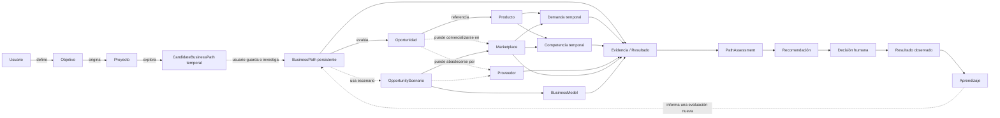
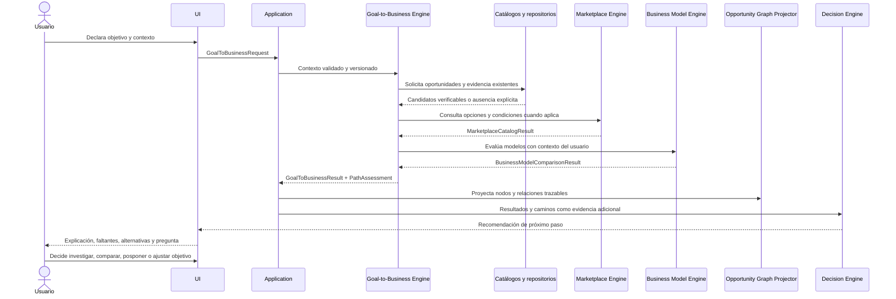

# Oriva — Goal-to-Business + Opportunity Graph Architecture

**Estado:** arquitectura aprobada

**Versión del documento:** 1.0

**Sprint:** 30 — arquitectura y documentación, sin implementación

**Compatibilidad:** Domain Model 1.0, ADR-001 a ADR-023 y motores publicados

## 1. Propósito

Esta especificación define cómo Oriva podrá transformar un objetivo económico y
el contexto declarado de una persona en caminos comerciales verificables. Un
camino no es una promesa de ingresos ni una instrucción de inversión: es una
hipótesis estructurada que conecta opciones existentes, evidencia, faltantes,
riesgos y un siguiente paso razonable.

La arquitectura incorpora dos capacidades relacionadas, pero distintas:

1. **Goal-to-Business:** convierte intención y recursos en candidatos que vale
   la pena explorar, investigar, comparar o posponer.
2. **Opportunity Graph:** conserva y permite recorrer las relaciones entre el
   usuario, su objetivo, las oportunidades, los escenarios y la evidencia que
   respalda o limita cada camino.

La promesa del producto será:

> A partir de lo que el usuario quiere conseguir y de los recursos que declara,
> Oriva presenta rutas comerciales candidatas, explica por qué podrían encajar,
> muestra qué falta por verificar y propone qué investigar después.

Oriva no garantiza ingresos, rentabilidad, ventas ni compatibilidad futura.

## 2. Principios obligatorios

1. **Objetivo antes que solución.** El sistema comprende intención, horizonte y
   criterios antes de buscar caminos.
2. **No inventar para completar el grafo.** Un camino incompleto permanece
   incompleto; la ausencia de evidencia nunca genera un nodo ficticio.
3. **Compatibilidad multidimensional.** Capital no domina tiempo, experiencia,
   logística, región, riesgo ni restricciones.
4. **Camino no equivale a oportunidad.** Una Oportunidad conserva su identidad;
   un camino explica una posible forma de investigarla y operarla.
5. **Comparar no equivale a decidir.** Los motores producen evaluaciones; el
   Decision Engine recomienda un próximo paso; el usuario decide.
6. **Evidencia trazable.** Hechos, estimaciones y supuestos se distinguen y
   conservan fuente, fecha, vigencia, región, confianza y versión.
7. **Historial inmutable.** Nueva información crea resultados, relaciones o
   snapshots nuevos; no reescribe el contexto de decisiones anteriores.
8. **Grafo conceptual, persistencia reemplazable.** Ninguna regla del dominio
   depende de una base de datos de grafos.
9. **Privacidad por diseño.** El grafo comercial no expone identidad, secretos o
   restricciones privadas sin autorización y necesidad explícitas.
10. **IA explicadora.** La IA puede sintetizar y guiar, pero no crea políticas,
    proveedores, demanda, competencia, costos ni evidencia comercial crítica.
11. **Comercio legal y transparente.** Caminos restringidos, no verificables o
    incompatibles se señalan; no se ofrecen atajos para evadir requisitos.
12. **Aprendizaje comprensible.** Cada camino explica cómo funciona el negocio,
    qué responsabilidades exige y qué podría invalidarlo.

## 3. Límites de las capacidades

### 3.1 Goal-to-Business responde

- ¿Qué rutas comerciales verificables guardan relación con el objetivo?
- ¿Cómo encaja cada ruta con recursos, capacidades y restricciones declaradas?
- ¿Qué evidencia favorece o contradice el camino?
- ¿Qué información falta y cómo podría obtenerse?
- ¿Qué tendría que cambiar para reconsiderar una ruta?

No responde si el usuario debe invertir, comprar o ejecutar una prueba.

### 3.2 Opportunity Graph responde

- ¿Qué entidades y resultados participaron en un análisis?
- ¿Cómo se conectan objetivo, oportunidad, escenario, evidencia y decisión?
- ¿Qué versión, región y momento describen cada relación?
- ¿Qué caminos alternativos existen hacia el mismo objetivo?
- ¿Qué cambió entre dos evaluaciones?

No calcula compatibilidad, ROI, demanda ni recomendaciones.

### 3.3 Decision Engine conserva su responsabilidad

El Decision Engine consume evaluaciones de caminos como evidencia adicional y
responde cuál es el siguiente paso razonable. No descubre rutas, no rellena
nodos ausentes y no transforma un camino candidato en una decisión humana.

## 4. Reutilización del dominio oficial

| Concepto existente | Uso en esta arquitectura | Decisión |
|---|---|---|
| Usuario | Propietario del contexto y de la decisión | Reutilizar |
| Perfil | Preferencias y contexto general confirmado | Reutilizar |
| Objetivo | Intención económica, horizonte y criterios de éxito | Reutilizar y ampliar aditivamente en el futuro |
| Proyecto | Límite de una iniciativa y su historial | Reutilizar |
| Oportunidad | Unidad central de evaluación comercial | Reutilizar; ADR-001 permanece vigente |
| Producto | Artículo independiente de canal y proveedor | Reutilizar |
| OpportunityScenario | Oportunidad bajo marketplace, modelo, costos y supuestos | Reutilizar; ADR-008 permanece vigente |
| Proveedor | Identidad de abastecimiento | Reutilizar cuando exista |
| Marketplace | Canal regional genérico | Reutilizar; puede faltar al explorar |
| BusinessModel | Forma operativa genérica | Reutilizar |
| Demanda / Competencia | Observaciones temporales y regionales | Reutilizar cuando existan |
| Investigación | Preguntas, fuentes y hallazgos | Reutilizar |
| Resultado | Evidencia inmutable producida por motores | Reutilizar |
| Recomendación | Orientación explicable | Reutilizar |
| Decisión | Elección humana | Reutilizar; ADR-002 permanece vigente |
| Historial / Aprendizaje | Evolución y conclusiones confirmables | Reutilizar |

### 4.1 No crear `BusinessGoal`

`Objetivo` ya representa intención, presupuesto, horizonte, restricciones y
criterios de éxito. Crear `BusinessGoal` duplicaría identidad y ciclo de vida.
Cuando se implemente, Objetivo podrá recibir de forma aditiva una especificación
económica estructurada, conservando su identidad oficial.

### 4.2 Separar `CandidateBusinessPath` y `BusinessPath`

`CandidateBusinessPath` es una representación temporal generada durante la
exploración. Puede estar incompleta, descartarse sin historial permanente y no
pertenece al Core. No recibe identidad de negocio estable y no se persisten
todas las combinaciones generadas por el sistema.

`BusinessPath` aparece solamente cuando el usuario guarda, selecciona o decide
investigar formalmente un candidato. Entonces se convierte en entidad
versionada dentro de un Proyecto, con ID interno estable, historial,
GoalContextSnapshot utilizado y referencias a evidencia y escenarios.

Responsabilidades futuras:

- conservar identidad propia y versión;
- referenciar Objetivo, Proyecto y una o varias Oportunidades;
- ordenar etapas verificables del camino;
- referenciar uno o varios OpportunityScenario sin copiar su contexto;
- declarar evidencia, faltantes, supuestos e invalidadores;
- permitir alternativas sin mutar Oportunidad ni escenarios históricos;
- registrar estado: borrador, incompleto, investigable, comparable, descartado,
  pospuesto o seleccionado por el usuario para continuar investigando.

`OpportunityScenario` conserva exclusivamente la combinación Opportunity +
Marketplace + BusinessModel + proveedor opcional + costos + condiciones +
supuestos + momento/vigencia. BusinessPath representa la ruta más amplia desde
Objetivo y contexto hasta oportunidades, escenarios, investigación y próximo
paso. `OpportunityPath` no se incorpora: sería un sinónimo ambiguo.

### 4.3 `GraphNode` y `GraphEdge` no son entidades del negocio

Son contratos de representación/proyección. Las entidades oficiales conservan
sus modelos e invariantes; el grafo contiene referencias tipadas a ellas. Esto
evita que una tecnología de almacenamiento defina el Core.

### 4.4 Recursos, capacidades y restricciones

No se proponen entidades independientes inicialmente:

- `ResourceAvailability`: objeto de valor versionado con capital, tiempo,
  espacio y otros recursos declarados.
- `CapabilityDeclaration`: objeto de valor que identifica capacidad, nivel,
  fuente —usuario o evidencia—, fecha y confianza.
- `ConstraintDeclaration`: objeto de valor con restricción, severidad, alcance,
  motivo y posibilidad de cambio.
- `PreferenceDeclaration`: objeto de valor explícitamente no vinculante.

Se agrupan en un `GoalContextSnapshot` inmutable. Solo adquirirán identidad
propia si necesitan ciclo de vida, verificación o reutilización independiente.

### 4.5 `PathAssessment`

Se propone como Resultado/contrato inmutable del futuro Goal-to-Business Engine,
no como entidad mutable. Evalúa un BusinessPath por dimensiones y no produce un
score único.

### 4.6 No crear `GoalMatch`

La relación entre objetivo y camino queda expresada por PathAssessment. Un
`GoalMatch` separado duplicaría compatibilidad y podría convertirse en una
clasificación opaca. Se reconsiderará únicamente si Opportunity Matching exige
un ciclo de vida independiente.

## 5. Modelo conceptual del Opportunity Graph



### 5.1 Tipos de nodo

El contrato de proyección admitirá referencias a:

- Usuario, Objetivo, Proyecto y BusinessPath persistente;
- Oportunidad, OpportunityScenario y Producto;
- Proveedor, Marketplace y BusinessModel;
- observaciones de Demanda y Competencia;
- Cotizaciones futuras y Resultados de costos;
- Investigación, Evidencia y Resultado;
- PathAssessment, Recomendación, Decisión, Prueba y Aprendizaje.

No todos los nodos son obligatorios. Una ruta incompleta muestra huecos, no
crea sustitutos.

### 5.2 Relaciones tipadas

Tipos iniciales conceptuales:

- `OWNS`, `DEFINES`, `ORIGINATES`, `CONTAINS`;
- `EVALUATES`, `REFERENCES`, `USES_SCENARIO`;
- `SOURCED_FROM`, `AVAILABLE_IN`, `OPERATED_AS`;
- `SUPPORTED_BY`, `CONTRADICTED_BY`, `ASSUMES`, `REQUIRES`;
- `CONSTRAINED_BY`, `INVALIDATED_BY`, `MISSING_EVIDENCE`;
- `PRODUCED`, `CONSIDERED`, `DECIDED_BY`, `OBSERVED_AS`, `LEARNED_FROM`;
- `ALTERNATIVE_TO`, `SUPERSEDES` y `DERIVED_FROM`.

Las relaciones no contienen reglas. Describen hechos o interpretaciones ya
producidas por el dominio y los motores.

### 5.3 Metadatos de relación

Cuando corresponda, cada relación conservará:

- `relation_id` interno estable;
- tipo y dirección;
- referencias de origen y destino;
- fuente o Resultado que la demuestra;
- `EvidenceType`: dato, estimación o supuesto;
- fecha de observación y periodo de vigencia;
- región y marketplace si delimitan su significado;
- confianza y estado de verificación;
- versiones de esquema, fuente, reglas y motor;
- supuestos, restricciones y limitaciones;
- ámbito de privacidad y autorización;
- referencia a la relación reemplazada, sin borrarla.

Una relación estructural como “Proyecto contiene Oportunidad” no necesita una
fuente comercial. Una relación empírica como “Producto tiene señal de demanda”
sí exige evidencia temporal, regional y trazable.

El Opportunity Graph es una proyección reconstruible/read model. Las entidades,
Resultados, snapshots e Historial oficiales permanecen como fuente canónica. La
eliminación o reconstrucción de la proyección no elimina ni altera verdad de
dominio.

## 6. Contratos conceptuales

### 6.1 GoalToBusinessRequest

- `request_id`, versión y fecha con zona horaria;
- Usuario, Objetivo y Proyecto opcional;
- `GoalContextSnapshot`;
- alcance de exploración permitido;
- regiones y monedas autorizadas;
- categorías o tipos de camino aceptados, si el usuario los declara;
- referencias a evidencia ya conocida;
- consentimiento y límites de uso de datos privados.

### 6.2 GoalContextSnapshot

- objetivo económico e indicador de éxito;
- horizonte y prioridad;
- presupuesto/capital con moneda;
- tiempo disponible y periodo;
- experiencia y etapa;
- tolerancia al riesgo;
- región;
- recursos, capacidades, restricciones y preferencias;
- procedencia de cada dato: declarado, verificado o inferencia autorizada;
- campos faltantes;
- fecha, versión y consentimiento.

No actualiza el Perfil automáticamente. Un contexto nuevo crea otro snapshot.

### 6.3 CandidateBusinessPath

- identificador técnico efímero, objetivo, proyecto y oportunidad;
- pasos ordenados mediante referencias tipadas;
- OpportunityScenario opcional;
- marketplace, BusinessModel y proveedor opcionales;
- evidencia favorable y contradictoria;
- supuestos explícitos;
- datos faltantes;
- requisitos y restricciones;
- invalidadores;
- región, fecha, vigencia, confianza y versión;
- estado de completitud y motivo de inclusión.

No requiere persistencia permanente. Solo puede convertirse en BusinessPath
mediante una acción explícita del usuario.

### 6.4 BusinessPath

- `business_path_id` interno estable;
- Objetivo y Proyecto obligatorios;
- GoalContextSnapshot exacto que originó la selección;
- una o varias Oportunidades;
- referencias a uno o varios OpportunityScenario;
- investigación, evidencia, faltantes e invalidadores;
- siguiente paso considerado;
- versión, historial y actor que lo guardó o seleccionó.

BusinessPath no duplica marketplaces, modelos, proveedores, costos, condiciones
ni supuestos ya conservados por OpportunityScenario.

### 6.5 PathAssessment

Por cada camino:

- estado: compatible para investigar, compatible con condiciones,
  indeterminado, incompatible o no disponible;
- evaluaciones separadas de capital, tiempo, experiencia, carga operativa,
  logística, almacenamiento, región, riesgo, requisitos, restricciones,
  marketplace, modelo operativo, evidencia comercial, dificultad y
  compatibilidad con el objetivo;
- explicación y evidencia de cada dimensión;
- trabajo requerido y responsabilidades;
- faltantes y preguntas de investigación;
- condiciones que cambiarían el resultado;
- invalidadores;
- confianza global limitada por la evidencia más débil relevante;
- reglas, fuente y versión del motor.

No contiene un score único, estimación de ingresos ni orden de ejecución.

### 6.6 GoalToBusinessResult

- caminos candidatos con sus assessments;
- caminos excluidos y razón comprobable;
- caminos incompletos que aún pueden investigarse;
- ausencia explícita de caminos cuando no hay evidencia;
- datos faltantes compartidos;
- advertencias de vigencia o contradicción;
- confianza;
- próximos temas de investigación posibles;
- versión, fecha y fuentes utilizadas.

### 6.7 OpportunityGraphSnapshot

- `graph_snapshot_id`, alcance, propietario y versión;
- fecha efectiva;
- conjunto inmutable de `DomainNodeReference`;
- conjunto inmutable de `EvidenceRelation`;
- raíces autorizadas y profundidad;
- nodos omitidos por privacidad o autorización;
- fuentes y versiones;
- cursor opcional para grafos grandes.

## 7. Flujo completo Goal-to-Business



Reglas del flujo:

1. Capturar y confirmar el objetivo; no inferir silenciosamente ingresos o
   tolerancia al riesgo.
2. Crear un GoalContextSnapshot y marcar campos ausentes.
3. Consultar únicamente oportunidades, catálogos y evidencia disponibles.
4. Generar CandidateBusinessPath efímeros solo desde hipótesis estructuradas o
   candidatos identificables; nunca inventar una oportunidad para completarlos.
5. Distinguir candidato, incompleto, investigable, con evidencia suficiente
   para considerar el siguiente paso e invalidado. Un camino incompleto nunca
   se presenta como listo para ejecutar.
6. Evaluar ajuste por dimensiones usando motores propietarios.
7. Proyectar relaciones después de que los motores produzcan resultados; el
   grafo no decide.
8. Enviar evaluaciones al Decision Engine.
9. Presentar explicación y permitir que el usuario cambie contexto o decida.
10. Persistir BusinessPath únicamente cuando el usuario lo guarda, selecciona o
    decide investigarlo formalmente.
11. Una nueva decisión o evidencia crea versiones nuevas y conserva historial.

### 7.1 Política de evidencia por etapa

No existe un número universal de evidencias requeridas:

- **Mostrar candidato:** puede bastar una hipótesis estructurada, claramente
  identificada como tal.
- **Mostrar camino incompleto:** requiere poder explicar evidencia disponible,
  faltantes, incertidumbre, restricciones e invalidadores.
- **Recomendar investigación:** requiere información suficiente para explicar
  qué investigar y por qué reduciría incertidumbre.
- **Considerar el siguiente paso:** requiere evidencia vigente adecuada a cada
  dimensión relevante.
- **Considerar una prueba futura:** exige señales comerciales y operativas
  verificadas conforme a las reglas vigentes del Decision Engine y aprobación
  humana.

La política será versionada por etapa/capacidad, no mediante un umbral global.

## 8. Ejemplo conceptual

Contexto declarado:

```text
Capital: 1,500 USD
Experiencia: principiante
Tiempo: 15 horas por semana
Región: US
Objetivo: construir una fuente adicional de ingresos
```

Si existen oportunidades y evidencia verificables, Oriva podría construir:

### Camino A — operación con mayor control directo

- Objetivo → Proyecto → Oportunidad 1 → Producto X.
- Producto X → Proveedor verificado A.
- Oportunidad 1 → Marketplace genérico A → Modelo operativo directo.
- Capital requerido: estimación trazable dentro del presupuesto declarado.
- Trabajo requerido: preparación, almacenamiento y logística del vendedor.
- Riesgo: mayor carga operativa para una persona principiante.
- Evidencia faltante: demanda regional, competencia y cotización vigente.
- Invalidadores: proveedor no verificable, restricción regional o logística
  superior a la capacidad declarada.
- Próximo paso posible: investigar requisitos y obtener evidencia faltante.

### Camino B — operación con responsabilidades delegadas

- Objetivo → Proyecto → la misma o distinta Oportunidad verificable.
- Oportunidad → Marketplace genérico B → otro BusinessModel.
- Capital requerido: estimación separada y versionada.
- Trabajo requerido: menor logística directa, pero nuevas condiciones y costos.
- Riesgo: dependencia operativa y menor control.
- Evidencia faltante: disponibilidad regional, costos finales y requisitos.
- Invalidadores: capital mínimo superior a 1,500 USD o modelo no disponible.
- Próximo paso posible: comparar compensaciones sin declarar ganador.

Si no existe una Oportunidad verificable, el resultado será:

```text
No se encontraron caminos sustentados por la evidencia disponible.
Faltan candidatos verificables; Oriva no inventará productos, proveedores,
marketplaces ni señales comerciales para completar una ruta.
```

## 9. Relación con los motores

| Componente | Responsabilidad | No debe hacer |
|---|---|---|
| Goal-to-Business Engine futuro | Orquestar candidatos y producir PathAssessment | Inventar oportunidades, decidir o prometer resultados |
| Opportunity Engine | Evaluar evidencia financiera de una Oportunidad | Convertir score financiero en ruta comercial |
| Marketplace Engine | Informar opciones y condiciones | Evaluar ajuste personal |
| Business Model Engine | Evaluar ajuste operativo multidimensional | Elegir por el usuario |
| Supplier Engine futuro | Evaluar abastecimiento y cotizaciones | Declarar demanda o rentabilidad |
| Demand Engine futuro | Producir observaciones de demanda | Garantizar ventas |
| Competition Engine futuro | Producir evidencia competitiva | Decidir estrategia final |
| Insight Engine | Sintetizar patrones y riesgos | Crear evidencia ausente |
| Decision Engine | Recomendar el siguiente paso | Ejecutar una decisión humana |
| Learning Engine futuro | Contrastar expectativas y resultados | Generalizar fuera del alcance de evidencia |
| Graph Projector | Materializar relaciones existentes | Aplicar reglas de negocio |

El Goal-to-Business Engine podrá coordinar resultados, pero no absorberá las
reglas internas de los demás motores.

## 10. Evolución hacia Opportunity Matching

El grafo permitirá detectar en el futuro relaciones potenciales entre:

- compradores y necesidades;
- vendedores y ofertas;
- pequeños negocios y capacidades;
- fabricantes, proveedores y distribuidores;
- revendedores, productos y marketplaces.

No se incorporan todavía entidades de matching. Una fase futura podrá proponer:

- `CommercialNeed`: necesidad confirmada, alcance, región y vigencia;
- `CommercialOffer`: oferta confirmada, capacidad, condiciones y vigencia;
- `ParticipantRole`: rol consentido dentro de un contexto;
- `MatchAssessment`: compatibilidad multidimensional y explicable.

El matching deberá:

1. operar sobre ofertas y necesidades explícitas, no perfiles inferidos;
2. requerir consentimiento antes de revelar identidades o contacto;
3. validar región, legalidad, capacidad, restricciones y vigencia;
4. conservar evidencia favorable y contradictoria;
5. no clasificar personas mediante un score opaco;
6. no prometer transacciones ni ingresos;
7. permitir rechazar, ocultar o retirar una oferta;
8. separar compatibilidad algorítmica de decisión y negociación humanas.

## 11. Persistencia independiente de tecnología

### 11.1 Modelo lógico

El dominio expone entidades, resultados y relaciones tipadas. Application usa
puertos conceptuales:

- `BusinessPathRepository`;
- `OpportunityGraphReader`;
- `OpportunityGraphWriter`;
- `EvidenceRepository`;
- `GoalContextRepository`;
- `HistoryEventStore`.

Los puertos no exponen consultas propias de una base de grafos.

### 11.2 Implementaciones posibles

- base relacional con tablas de referencias y relaciones;
- almacenamiento documental para snapshots;
- event store para historial;
- índice de búsqueda para descubrimiento;
- base de grafos como proyección optimizada futura.

Pueden coexistir. Las entidades y resultados oficiales son la fuente canónica;
Opportunity Graph es siempre una proyección reconstruible/read model. No se
elige todavía Neo4j, extensiones de PostgreSQL, base documental ni otra
tecnología. Cambiar de implementación no altera IDs, contratos ni reglas.

### 11.3 Versionado y consistencia

- IDs internos estables y referencias externas separadas;
- escrituras idempotentes por versión;
- snapshots inmutables;
- relaciones reemplazadas mediante `SUPERSEDES`, nunca edición silenciosa;
- consistencia eventual permitida para proyecciones;
- decisiones leen un snapshot identificado, no “el estado más reciente” sin
  versión;
- migraciones contractuales explícitas y reversibles cuando sea posible.

## 12. Privacidad y seguridad

1. Separar datos de identidad de las relaciones comerciales del grafo.
2. Usar IDs pseudónimos en proyecciones y matching.
3. Clasificar datos: público, del usuario, confidencial, restringido.
4. Aplicar autorización por nodo, relación, proyecto y propósito.
5. No almacenar credenciales, tokens, secretos de proveedores ni documentos
   sensibles como propiedades del grafo.
6. Minimizar capital, restricciones y preferencias visibles a terceros.
7. Cifrar información sensible en tránsito y reposo mediante infraestructura
   externa al dominio.
8. Mantener registro auditable de acceso, exportación y consentimiento.
9. Definir retención, eliminación y anonimización antes de multiusuario.
10. Evitar que recorridos indirectos revelen relaciones privadas.
11. No usar datos privados para entrenamiento o matching sin consentimiento.
12. Permitir al usuario corregir datos declarados sin reescribir decisiones
    históricas que usaron snapshots anteriores.

## 13. Escalabilidad

- Limitar consultas por raíces, profundidad, región y periodo.
- Paginar nodos y relaciones; evitar cargar el grafo completo.
- Separar escritura canónica de proyecciones de lectura.
- Cachear únicamente snapshots versionados y respetar freshness.
- Deduplicar por identidad interna y contexto, no solo por nombre.
- Precalcular vistas autorizadas por Proyecto, nunca conclusiones globales.
- Procesar nuevas evidencias mediante eventos idempotentes.
- Conservar lineage para reconstruir recomendaciones.
- Medir tamaño, latencia, fan-out, relaciones huérfanas y evidencia expirada.
- Archivar versiones históricas sin eliminarlas de la auditoría autorizada.

## 14. Riesgos arquitectónicos

| Riesgo | Mitigación propuesta |
|---|---|
| Explosión de caminos combinatorios | Límites por alcance, evidencia mínima y deduplicación contextual |
| Grafo convertido en “bolsa de datos” | Tipos cerrados, contratos versionados e invariantes |
| Caminos falsos por datos incompletos | Estado incompleto, confianza reducida y prohibición de inventar nodos |
| Confundir camino con recomendación | BusinessPath, PathAssessment, Recomendación y Decisión separados |
| Duplicar OpportunityScenario | BusinessPath lo referencia; no replica su contexto |
| Score opaco de ajuste | Comparación multidimensional y ADR obligatorio antes de cualquier score |
| Evidencia vieja | Freshness por tipo, snapshots y fecha efectiva |
| Inferencia de datos privados | Consentimiento, minimización y separación de identidad |
| Traversals que eluden autorización | Autorización por relación y vistas filtradas |
| Dependencia de base de grafos | Puertos tecnológicos neutrales y proyección reconstruible |
| IA presentada como fuente | Etiquetado de texto generado y referencias verificables |
| Matching discriminatorio o invasivo | Criterios auditables, consentimiento y revisión humana |

## 15. Compatibilidad con ADR-001 a ADR-023

- **ADR-001:** Oportunidad continúa siendo unidad central de evaluación;
  BusinessPath la conecta con un Objetivo sin reemplazarla.
- **ADR-002:** PathAssessment y Recomendación no son Decisión.
- **ADR-003:** resultados, caminos evaluados y snapshots son versionados.
- **ADR-004:** el grafo no incorpora Amazon ni identificadores externos como
  identidad del Core.
- **ADR-005:** proveedores de candidatos y fuentes entran por adaptadores.
- **ADR-006:** relaciones empíricas conservan fuente, vigencia y confianza.
- **ADR-007:** BusinessModel permanece genérico.
- **ADR-008:** BusinessPath referencia OpportunityScenario y no agrega
  `business_model_id` a Opportunity.
- **ADR-009:** condiciones externas se referencian mediante snapshots.
- **ADR-010:** Marketplace, Business Model y Decision Engine conservan límites.
- **ADR-011:** PathAssessment tampoco introduce un score único.
- **ADR-012:** temas educativos no sustituyen requisitos oficiales.
- **ADR-013:** IA explica el grafo, no crea su verdad comercial.
- **ADR-014:** cada relación temporal respeta freshness según su tipo.

No se identifica una contradicción con las decisiones aceptadas. La tensión
principal entre BusinessPath y OpportunityScenario queda resuelta: el primero
representa la ruta amplia y referencia al segundo, que conserva el contexto
operativo concreto.

## 16. ADR aceptados en este cierre

- [ADR-015 — Objetivo como raíz de Goal-to-Business](../adr/ADR-015-goal-root.md)
- [ADR-016 — CandidateBusinessPath y BusinessPath](../adr/ADR-016-candidate-and-business-path.md)
- [ADR-017 — BusinessPath y OpportunityScenario](../adr/ADR-017-business-path-opportunity-scenario.md)
- [ADR-018 — GoalContextSnapshot inmutable](../adr/ADR-018-goal-context-snapshot.md)
- [ADR-019 — PathAssessment multidimensional](../adr/ADR-019-multidimensional-path-assessment.md)
- [ADR-020 — Opportunity Graph no canónico](../adr/ADR-020-opportunity-graph-projection.md)
- [ADR-021 — EvidenceRelation trazable](../adr/ADR-021-evidence-relation.md)
- [ADR-022 — Goal-to-Business como orquestador](../adr/ADR-022-goal-to-business-orchestrator.md)
- [ADR-023 — Opportunity Matching opt-in](../adr/ADR-023-opportunity-matching-opt-in.md)

## 17. Decisiones pendientes de aprobación humana

1. Definir nombres finales y transiciones de los estados de camino.
2. Definir políticas versionadas de evidencia por etapa/capacidad.
3. Seleccionar severidad de restricciones y criterios de invalidación.
4. Definir propietarios y políticas de actualización de GoalContextSnapshot.
5. Elegir almacenamiento canónico para entidades, sin convertir el grafo en
   fuente de verdad.
6. Aprobar modelo de autorización, consentimiento, retención y eliminación.
7. Definir si el grafo será por usuario, proyecto, organización o vistas
    combinables.
8. Aprobar límites de exploración para controlar explosión combinatoria.
9. Definir criterios legales y de seguridad para matching futuro.
10. Decidir qué evidencia puede compartirse entre usuarios sin revelar datos
    privados o propietarios.

## 18. Incorporación futura al Domain Model oficial

Una implementación posterior deberá proponer, revisar y probar antes de cambiar
`domain/`:

- Objetivo como raíz de Goal-to-Business, sin crear BusinessGoal;
- BusinessPath como entidad persistente y CandidateBusinessPath como contrato
  temporal fuera del Core;
- GoalContextSnapshot y sus objetos de valor;
- PathAssessment como Resultado/contrato inmutable;
- contratos de DomainNodeReference, EvidenceRelation y OpportunityGraphSnapshot;
- referencias de BusinessPath a OpportunityScenario, sin duplicación;
- estados, invariantes, versionado, privacidad y serialización.

Esta documentación no autoriza todavía clases, migraciones ni persistencia.

## 19. Alcance explícitamente excluido

- clases, tablas, repositorios o migraciones;
- base de datos de grafos;
- Goal-to-Business Engine ejecutable;
- descubrimiento o generación de oportunidades;
- Opportunity Matching;
- Supplier, Demand, Competition o Learning Engines;
- Amazon, APIs, scraping o credenciales;
- UI;
- score de caminos;
- automatización de compras, contacto o inversión;
- promesas de ingresos o rentabilidad.
