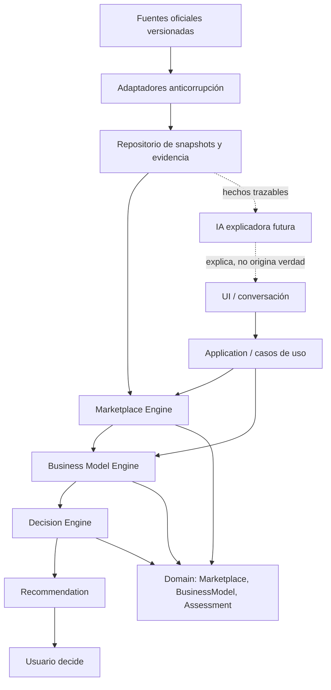
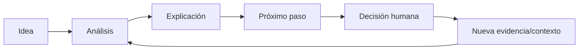

# Oriva — Marketplace & Business Model Architecture

**Estado:** arquitectura aprobada

**Versión del documento:** 1.0

**Sprint:** 24 — diseño, sin implementación

**Compatibilidad:** Domain Model 1.0 y ADR-001 a ADR-006

## 1. Propósito

Esta especificación define cómo Oriva podrá conocer marketplaces y sus modelos
operativos, compararlos con el contexto real de una persona, explicar sus
compensaciones y proponer un próximo paso razonable sin decidir por el usuario.

La capacidad debe ser independiente de Amazon. Ninguna tarifa, política, nombre
de programa o estructura de una plataforma externa entra directamente al Core.

La promesa funcional futura es:

> Dada una oportunidad y el contexto declarado del usuario, presentar las
> formas verificadas de operarla, explicar cómo encaja cada una, declarar lo que
> falta por comprobar y ayudar al usuario a elegir qué investigar después.

No promete rentabilidad, no ejecuta compras y no convierte una recomendación en
una decisión.

## 2. Principios rectores

1. **Core independiente del canal.** Amazon, Walmart y cualquier API externa se
   representan mediante adaptadores anticorrupción.
2. **Marketplace y modelo operativo son conceptos distintos.** El primero
   define el canal; el segundo, una forma concreta de operar dentro de él.
3. **El ajuste es contextual.** Presupuesto es una señal entre varias, no el
   criterio único.
4. **La ausencia de información es explícita.** Nunca se completa con
   invenciones o conocimiento no trazable.
5. **Toda condición cambiante tiene vigencia.** Tarifas, requisitos y políticas
   se consultan por versión y región.
6. **Comparar no equivale a decidir.** Business Model Engine produce evidencia
   comparativa; Decision Engine propone el siguiente paso; el usuario decide.
7. **Resultados reproducibles.** Una comparación identifica versión de reglas,
   entradas, evidencia y fecha de evaluación.
8. **Educación separada de la verdad operativa.** La explicación puede adaptarse
   al usuario; los hechos oficiales proceden de fuentes verificables.
9. **BusinessModel pertenece al dominio.** El Core modela el concepto genérico;
   FBA, FBM, WFS y equivalentes pertenecen a catálogos/adaptadores externos.
10. **Sin score único inicial.** La compatibilidad se compara por dimensiones
    explicables y no se reduce todavía a una puntuación.

## 3. Lenguaje del dominio propuesto

### 3.1 Marketplace

Capacidad/canal comercial en una región determinada. Su identidad es estable y
propia de Oriva; sus nombres e identificadores externos son referencias.

Responsabilidades:

- identificar canal, país/región y monedas admitidas;
- declarar categorías y capacidades disponibles;
- referenciar condiciones vigentes, nunca incrustarlas como verdad permanente;
- enumerar los modelos operativos disponibles en un contexto específico;
- aislar vocabulario y reglas particulares del proveedor externo.

Marketplace sigue siendo opcional durante exploración e investigación. Es
obligatorio antes de comparar políticas, costos o evidencia comercial concreta.

### 3.2 BusinessModel / ModeloOperativo

Forma concreta y versionada de operar dentro de un Marketplace y región. No es
un sinónimo universal de fulfillment: puede incluir responsabilidades,
restricciones y flujos que varían por canal.

Ejemplos externos —solo como referencias traducidas—:

- Amazon FBA y FBM;
- Walmart WFS y Seller Fulfilled;
- otros modelos que cada adaptador pueda demostrar.

Responsabilidades:

- describir cómo funciona el modelo;
- separar responsabilidades del usuario y del marketplace;
- declarar capacidades de almacenamiento, fulfillment, envío, devoluciones y
  atención al cliente;
- referenciar costos, requisitos, restricciones, riesgos y evidencia vigentes;
- ofrecer atributos comparables sin fingir equivalencia entre marketplaces.

### 3.3 MarketplaceConditionSnapshot

Instantánea inmutable y versionada de condiciones externas verificadas para una
combinación de marketplace, región, periodo y, cuando aplique, categoría o
modelo operativo.

Puede contener referencias a:

- tarifas;
- políticas;
- requisitos de elegibilidad;
- restricciones de producto;
- capacidades logísticas;
- límites operativos.

Una instantánea nueva no modifica ni sustituye retroactivamente una anterior.

### 3.4 BusinessModelAssessment

Resultado inmutable de comparar un ModeloOperativo con un usuario, proyecto y
oportunidad en un momento concreto. No es una Decisión.

Incluye compatibilidad, razones, incompatibilidades, responsabilidades, costos
relevantes, riesgos, datos faltantes, confianza y condiciones que podrían
cambiar la evaluación.

### 3.5 EducationalPath

Plan educativo derivado de un modelo operativo y nivel de experiencia. Separa
el contenido factual versionado de su forma de explicación.

Incluye módulos, conceptos previos, pasos, errores comunes, métricas a observar,
preguntas de comprobación y condiciones para reconsiderar el modelo.

## 4. Entidades propuestas

### Marketplace

- `marketplace_id`: identidad interna estable.
- nombre canónico.
- referencias externas y alias.
- estado: borrador, disponible, restringido, inactivo.
- regiones admitidas.
- referencias a versiones de capacidades y condiciones.

Invariantes:

- no depende de identificadores de una API como identidad primaria;
- no contiene una tarifa o política cambiante como atributo permanente;
- toda capacidad regional requiere evidencia vigente.

### BusinessModel

- `business_model_id`.
- `marketplace_id` obligatorio.
- nombre canónico y nombre externo.
- descripción neutral.
- región o alcance territorial.
- tipo de fulfillment y capacidades.
- responsabilidades del vendedor.
- responsabilidades del marketplace.
- referencias a estructura de costos, requisitos y restricciones versionadas.
- carga operativa, experiencia recomendada y escalabilidad como evaluaciones
  trazables, no etiquetas absolutas.
- ventajas, desventajas y riesgos respaldados por evidencia.
- estado: borrador, verificado, disponible, restringido, desactualizado,
  retirado.

Invariantes:

- pertenece exactamente a un Marketplace;
- un nombre equivalente no implica comportamiento equivalente entre canales;
- no puede declararse disponible sin región, fuente y vigencia verificables;
- capital aproximado solo aparece cuando existe evidencia y debe declarar rango,
  moneda, supuestos y fecha;
- no garantiza ventas, beneficio ni adecuación.

### MarketplaceConditionSnapshot

- `snapshot_id`.
- marketplace, región y moneda.
- modelo operativo y categoría opcionales.
- versión de esquema y fuente.
- fecha de consulta y periodo de vigencia.
- estado de verificación.
- nivel de confianza.
- condiciones normalizadas y referencia al contenido original.

Estados: capturada, validación pendiente, verificada, vigente, próxima a
expirar, expirada, reemplazada o retirada.

### BusinessModelAssessment

- `assessment_id`.
- proyecto y oportunidad.
- marketplace y modelo operativo.
- contexto utilizado y campos ausentes.
- compatibilidad y motivos.
- factores favorables y desfavorables.
- responsabilidades y requisitos relevantes.
- costos aplicables como referencias a Resultados/Evidencia.
- riesgos y alternativas.
- confianza.
- versión del motor y reglas aplicadas.
- fecha con zona horaria.

Estados de compatibilidad: compatible, compatible con condiciones,
indeterminado, incompatible o no disponible.

### OpportunityScenario

- `scenario_id`.
- referencia obligatoria a Opportunity.
- Marketplace, región y BusinessModel específicos.
- Proveedor opcional.
- referencias a costos y MarketplaceConditionSnapshot.
- momento de evaluación, vigencia y supuestos.
- Resultados y assessments producidos bajo ese contexto.
- estado: borrador, evaluable, evaluado, desactualizado, descartado o elegido
  por el usuario para continuar investigando.

Invariantes:

- no modifica la identidad ni los resultados históricos de Opportunity;
- no existe sin Opportunity, Marketplace, región y BusinessModel;
- costos, condiciones y supuestos quedan versionados o referenciados;
- escenarios distintos pueden compararse, pero nunca se fusionan implícitamente;
- seleccionar un escenario es una acción humana, no una salida automática.

### EducationalPath

- `educational_path_id`.
- modelo operativo y versión de contenido.
- nivel: principiante, intermedio o avanzado.
- región e idioma.
- módulos ordenados.
- fuentes, vigencia y revisión humana.
- requisitos previos y criterios de finalización.

## 5. Value Objects propuestos

Todos serán inmutables y compararán por valor:

- `MarketplaceId` y `BusinessModelId`.
- `Region`: país, subdivisión y alcance; evita regiones implícitas.
- `CurrencyCode`: moneda ISO cuando sea aplicable.
- `EffectivePeriod`: inicio, fin opcional y estado de vigencia.
- `SourceReference`: proveedor, URL/identificador, tipo de fuente y fecha de
  consulta.
- `VerificationStatus`: no verificado, parcialmente verificado, verificado,
  disputado o expirado.
- `ConfidenceLevel`: reutiliza el objeto oficial.
- `Responsibility`: actor, acción, alcance y condición.
- `OperationalLoad`: dimensiones separadas de tiempo, almacenamiento, soporte,
  preparación y logística; nunca un único número opaco.
- `FulfillmentCapability`: almacenamiento, preparación, transporte, entrega,
  devoluciones y servicio al cliente.
- `CostComponent`: nombre, tipo, importe o porcentaje, base de cálculo, moneda,
  región, vigencia, fuente y supuestos. No ejecuta fórmulas financieras.
- `Requirement`: requisito, sujeto, evidencia y severidad.
- `Restriction`: alcance, motivo, región, categoría y fuente.
- `ExperienceLevel`: principiante, intermedio o avanzado.
- `FitFactor`: dimensión, evidencia, efecto, explicación y confianza.
- `MissingInformation`: dato requerido, motivo y forma de obtenerlo.
- `SchemaVersion`, `RuleVersion` y `ContentVersion`.

## 6. Contratos propuestos

### MarketplaceCatalogQuery

Entradas:

- región y país;
- categoría/producto opcional;
- marketplace opcional;
- fecha efectiva solicitada;
- moneda preferida.

Salida `MarketplaceCatalogResult`:

- marketplaces disponibles;
- modelos operativos disponibles por marketplace;
- opciones restringidas o desconocidas y motivo;
- snapshots utilizados;
- información faltante;
- advertencias de vigencia;
- versión del catálogo.

### BusinessModelComparisonRequest

- identificadores de proyecto y oportunidad;
- modelos candidatos;
- presupuesto y moneda;
- experiencia;
- tiempo disponible;
- objetivo;
- tolerancia al riesgo;
- país/región;
- producto/categoría;
- capacidad de almacenamiento, preparación, envío, devoluciones y soporte;
- etapa del negocio;
- restricciones declaradas;
- resultados y evidencia existentes;
- fecha efectiva.

### BusinessModelComparisonResult

- evaluaciones por modelo;
- modelos compatibles;
- modelos incompatibles y motivos;
- modelos indeterminados por falta de datos;
- modelo que merece mayor consideración, si existe;
- razones ordenadas y trazables;
- costos y requisitos relevantes;
- responsabilidades del usuario y del canal;
- ventajas, desventajas y riesgos;
- información faltante;
- nivel de confianza;
- alternativas;
- condiciones que cambiarían el resultado;
- siguiente paso sugerido;
- reglas, fuentes y versiones utilizadas;
- limitaciones.

### BusinessModelEducationRequest / Result

La solicitud identifica modelo, región, idioma, experiencia, objetivo y temas
ya comprendidos. El resultado entrega contenido estructurado y fuentes; la
presentación conversacional es responsabilidad de UI o de un explicador futuro.

## 7. Motores y responsabilidades

### Marketplace Engine

Responde: **¿qué opciones existen y bajo qué condiciones verificadas?**

- consulta el catálogo normalizado;
- filtra por región, categoría, fecha y restricciones;
- detecta información expirada o contradictoria;
- devuelve modelos disponibles y condiciones, sin juzgar el ajuste personal;
- nunca calcula ROI ni decide por el usuario.

### Business Model Engine

Responde: **¿cómo encaja cada opción con este usuario y proyecto?**

- compara contexto con requisitos y carga operativa;
- clasifica compatibilidad e incertidumbre;
- explica factores favorables, desfavorables y faltantes;
- produce `BusinessModelAssessment` reproducible;
- no elige de manera definitiva ni modifica una Opportunity;
- no sustituye al Decision Engine.

### Decision Engine

Responde: **¿cuál es el siguiente paso razonable con toda la evidencia?**

- consume assessments como evidencia adicional;
- mantiene separados Recomendación y Decisión;
- reduce confianza ante datos ausentes, no verificados o vencidos;
- no habilita una prueba solo por ajuste operativo o capacidad financiera.

### Education Service futuro

Responde: **¿qué necesita comprender y hacer el usuario para evaluar este
modelo?** Selecciona una ruta versionada, pero no altera hechos del catálogo.

## 8. Separación arquitectónica



Dependencias permitidas:

```text
UI → Application → Motores → Domain
Fuentes externas → Adaptadores → Contratos internos → Application
Persistencia implementa puertos; el Domain no importa persistencia.
```

## 9. Flujo completo del usuario

1. El usuario abre o crea un Proyecto y describe objetivo, país y etapa.
2. Declara presupuesto, experiencia, tiempo, riesgo y capacidad logística; puede
   dejar datos desconocidos.
3. Selecciona una Opportunity existente o un Product aún sin marketplace.
4. Marketplace Engine consulta opciones vigentes para región/categoría.
5. La UI muestra opciones disponibles, restringidas y no verificables.
6. El usuario elige cuáles comparar; Oriva no presupone un canal.
7. Business Model Engine genera una evaluación por opción.
8. Oriva explica responsabilidades, costos, requisitos, ventajas, riesgos y
   datos faltantes usando el nivel educativo adecuado.
9. Decision Engine combina evidencia financiera, comercial y operativa para
   sugerir un siguiente paso: explorar, investigar, comparar o posponer.
10. El usuario acepta, rechaza o ignora la recomendación y registra su Decisión.
11. La nueva investigación o contexto produce Resultados nuevos, nunca modifica
    evaluaciones históricas.
12. Oriva vuelve a comparar y explica qué cambió y por qué.



## 10. Comparación contextual

El motor evalúa dimensiones separadas; no crea un promedio opaco inicial:

- viabilidad regional y elegibilidad;
- ajuste al presupuesto y exposición de capital;
- ajuste a experiencia;
- disponibilidad de tiempo;
- capacidad de almacenamiento y logística;
- preferencia de control frente a delegación;
- objetivo y horizonte;
- tolerancia al riesgo;
- categoría y restricciones del producto;
- etapa del negocio;
- calidad, vigencia y cobertura de la evidencia.

Cada factor debe devolver: evidencia, efecto, explicación, confianza y regla.
Los pesos futuros, si existen, serán versionados, visibles y aprobados mediante
ADR. El Sprint 24 no define una fórmula de puntuación.

### Ejemplo: mismo presupuesto, recomendaciones distintas

**Usuario A:** USD 5,000, principiante, poco tiempo y sin almacenamiento. Un
modelo con fulfillment delegado podría merecer consideración si está disponible
y sus costos/requisitos se verifican. Oriva explicaría mayor delegación y costos,
sin afirmar que sea rentable.

**Usuario B:** USD 5,000, experiencia, tiempo y espacio, con preferencia por
control operativo. Un modelo gestionado por el vendedor podría merecer mayor
consideración. La diferencia procede del contexto operativo, no del dinero.

## 11. Estrategia educativa

Cada modelo ofrece trece módulos base:

1. qué es;
2. cómo funciona;
3. qué hace el marketplace;
4. qué hace el usuario;
5. qué se necesita para comenzar;
6. costos y su naturaleza;
7. flujo del dinero;
8. riesgos;
9. errores comunes;
10. primeros pasos;
11. métricas que observar;
12. cuándo reconsiderarlo;
13. cuándo evaluar un cambio de modelo.

Adaptación por experiencia:

- **Principiante:** una acción principal, vocabulario sencillo, ejemplos,
  glosario y comprobaciones de comprensión.
- **Intermedio:** comparaciones, estructura de costos, compensaciones y
  escenarios.
- **Avanzado:** supuestos, métricas, sensibilidad, trazabilidad, excepciones y
  optimización.

Reglas educativas:

- adaptar el lenguaje no cambia el hecho ni su fuente;
- distinguir siempre dato, estimación y supuesto;
- señalar políticas expiradas o no verificadas;
- no presentar ejemplos como resultados esperables;
- enlazar cada requisito/costo cambiante a su evidencia;
- permitir que el usuario solicite más o menos detalle sin perder trazabilidad.

## 12. Versionado, fuentes y vigencia

Toda condición externa debe conservar:

- fuente primaria o secundaria claramente identificada;
- URI o identificador de documento;
- fecha y hora de consulta;
- inicio y fin de vigencia, cuando se conozcan;
- país, región, moneda, categoría y modelo aplicables;
- versión de esquema y del adaptador;
- confianza;
- estado de verificación;
- fragmento normalizado y referencia al original;
- limitaciones o contradicciones conocidas.

Política de uso:

1. `verificada + vigente`: puede alimentar una comparación con su alcance.
2. `parcial`: puede mostrarse con confianza reducida y advertencia.
3. `expirada`: no se presenta como actual ni habilita compatibilidad.
4. `contradictoria`: se muestra como conflicto pendiente de resolución.
5. `sin fuente`: no se trata como condición oficial.

Las decisiones históricas conservan las versiones utilizadas. Una actualización
genera un nuevo assessment y explica diferencias; nunca reescribe el anterior.

No existe una expiración universal. La arquitectura admite políticas de
freshness diferentes y versionadas para:

- tarifas;
- políticas;
- restricciones;
- disponibilidad;
- requisitos;
- señales comerciales.

Cada política futura definirá cómo determinar vigente, próxima a expirar,
expirada o en conflicto usando tipo, fuente, región, fecha declarada, fecha de
consulta, volatilidad y verificación. Este sprint no fija duraciones concretas.

## 13. Relación con Opportunity

La definición oficial permanece intacta durante este sprint:

```text
Product
+ Marketplace opcional
+ Supplier opcional
+ Costs / Cotizaciones
+ Market Evidence
= Opportunity contextual

Opportunity
+ Marketplace
+ Region
+ BusinessModel
+ Supplier opcional
+ Costs
+ MarketplaceConditionSnapshots
+ Momento, vigencia y supuestos
= OpportunityScenario
```

Decisión aprobada:

- durante exploración, Opportunity puede no tener Marketplace;
- al comparar operación, `BusinessModelAssessment` referencia la Opportunity sin
  modificarla;
- `OpportunityScenario` reúne el contexto específico de un modelo sin añadir
  `business_model_id` directamente a Opportunity;
- un mismo Product/Marketplace puede tener varias oportunidades o escenarios
  por modelo operativo, proveedor, costos, región y fecha;
- cambiar de modelo no altera el Product ni los Resultados anteriores.

## 14. Integraciones y adaptadores

Cada marketplace tendrá un adaptador que:

- autentica y consulta fuera del Core;
- conserva respuesta original de acuerdo con políticas de datos;
- traduce vocabulario externo a contratos internos;
- valida región, moneda, categoría y fechas;
- adjunta fuente, vigencia, confianza y estado de verificación;
- reporta campos no traducibles sin inventarlos;
- dispone de pruebas contractuales con fixtures versionados.

Los adaptadores no:

- generan recomendaciones;
- calculan ajuste del usuario;
- mezclan condiciones de regiones distintas;
- convierten documentación promocional en garantía;
- introducen nombres específicos del canal en entidades genéricas.

## 15. Preparación para IA

La IA futura opera como **explicador**, nunca como fuente de verdad.

Puede:

- explicar assessments y políticas verificadas;
- comparar responsabilidades y compensaciones;
- adaptar profundidad y vocabulario;
- responder preguntas usando evidencia recuperada;
- guiar la ruta educativa;
- señalar datos faltantes.

No puede:

- inventar tarifas, políticas, elegibilidad o requisitos;
- elevar confianza sin nueva evidencia;
- ocultar vigencia o fuente;
- decidir o ejecutar una inversión;
- alterar resultados históricos.

Toda respuesta asistida por IA debe distinguir citas del catálogo, inferencias
del motor y explicación generada. Ante ausencia o expiración, debe decir que no
dispone de información vigente y proponer cómo verificarla.

## 16. Riesgos arquitectónicos y mitigaciones

### Falsa equivalencia entre marketplaces

**Riesgo:** forzar todos los modelos a una plantilla demasiado rígida.

**Mitigación:** capacidades opcionales, requisitos tipados y extensiones por
adaptador sin contaminar el Core.

### Datos desactualizados

**Riesgo:** recomendar con tarifas o políticas antiguas.

**Mitigación:** snapshots versionados, expiración, alertas y bloqueo de estados
que requieren verificación.

### Puntuación opaca

**Riesgo:** ocultar compensaciones dentro de un score único.

**Mitigación:** factores explicables primero; cualquier ponderación futura exige
versión, pruebas y ADR.

### Contexto incompleto o autodeclarado

**Riesgo:** presentar un ajuste aparente con datos débiles.

**Mitigación:** declarar supuestos, mostrar faltantes y reducir confianza.

### Contaminación del Core

**Riesgo:** introducir FBA/WFS, respuestas de API o reglas particulares como
conceptos universales.

**Mitigación:** IDs internos, adaptadores anticorrupción y contratos genéricos.

### Mezcla de educación y cumplimiento

**Riesgo:** que una explicación simplificada omita una condición oficial.

**Mitigación:** contenido factual separado, fuentes visibles y revisión humana.

### Explosión de escenarios

**Riesgo:** combinaciones de producto, región, modelo, proveedor y fecha.

**Mitigación:** `OpportunityScenario`, referencias inmutables y comparación bajo
demanda, sin duplicar entidades base.

## 17. Evolución futura

1. Incorporar BusinessModel, OpportunityScenario y snapshots de forma aditiva,
   sin conectar todavía los motores.
2. Crear repositorio de snapshots y puertos de consulta.
3. Definir políticas de freshness por tipo de información.
4. Definir un piloto de integración con Amazon, región y categoría concretas.
5. Implementar el adaptador piloto únicamente con documentación oficial vigente.
6. Implementar Marketplace Engine con detección de vigencia.
7. Implementar Business Model Engine determinista, multidimensional y explicable.
8. Integrar assessments al Decision Engine como evidencia adicional.
9. Crear rutas educativas versionadas.
10. Añadir IA explicadora con recuperación exclusiva de evidencia aprobada.
11. Expandir marketplaces mediante nuevos adaptadores, no bifurcando el Core.

Amazon queda registrado únicamente como candidato de la primera integración. La
región, categoría, API/fuentes y alcance deberán aprobarse en un sprint posterior
usando documentación oficial vigente. Esta decisión no introduce Amazon al Core.

## 18. ADR aceptados por esta arquitectura

1. **ADR-007 — BusinessModel como concepto oficial del dominio.**
2. **ADR-008 — OpportunityScenario para contextos operativos comparables.**
3. **ADR-009 — Snapshots versionados de condiciones de marketplace.**
4. **ADR-010 — Separación Marketplace/Business Model/Decision Engine.**
5. **ADR-011 — Comparación multidimensional sin score único inicial.**
6. **ADR-012 — Separación entre educación y condiciones oficiales.**
7. **ADR-013 — IA como explicador, no fuente de verdad externa.**
8. **ADR-014 — Vigencia por tipo de información externa.**

## 19. Decisiones pendientes para implementación

1. ¿Qué autoridad puede marcar una fuente como verificada?
2. ¿Qué reglas concretas de freshness corresponden a cada tipo y fuente?
3. ¿Qué región y categoría de Amazon formarán el piloto?
4. ¿Qué APIs o documentos oficiales pueden utilizarse y bajo qué condiciones?
5. ¿Qué contenidos requieren revisión legal, fiscal u operativa?
6. ¿Qué evidencia externa puede almacenarse y durante cuánto tiempo?
7. ¿Cómo se registra el consentimiento del usuario antes de convertir una
    recomendación en Decisión o Prueba?

## 20. Criterios de aceptación para implementación futura

- agregar un marketplace no requiere modificar el Core financiero;
- ninguna condición externa carece de fuente, región y vigencia;
- modelos incompatibles explican el motivo;
- modelos indeterminados declaran información faltante;
- presupuesto nunca decide por sí solo;
- el usuario puede rastrear cada razón hasta evidencia;
- la salida no promete rentabilidad;
- `Recommendation` y `Decision` permanecen separadas;
- la IA no puede crear condiciones oficiales;
- evaluaciones históricas permanecen reproducibles e inmutables.
