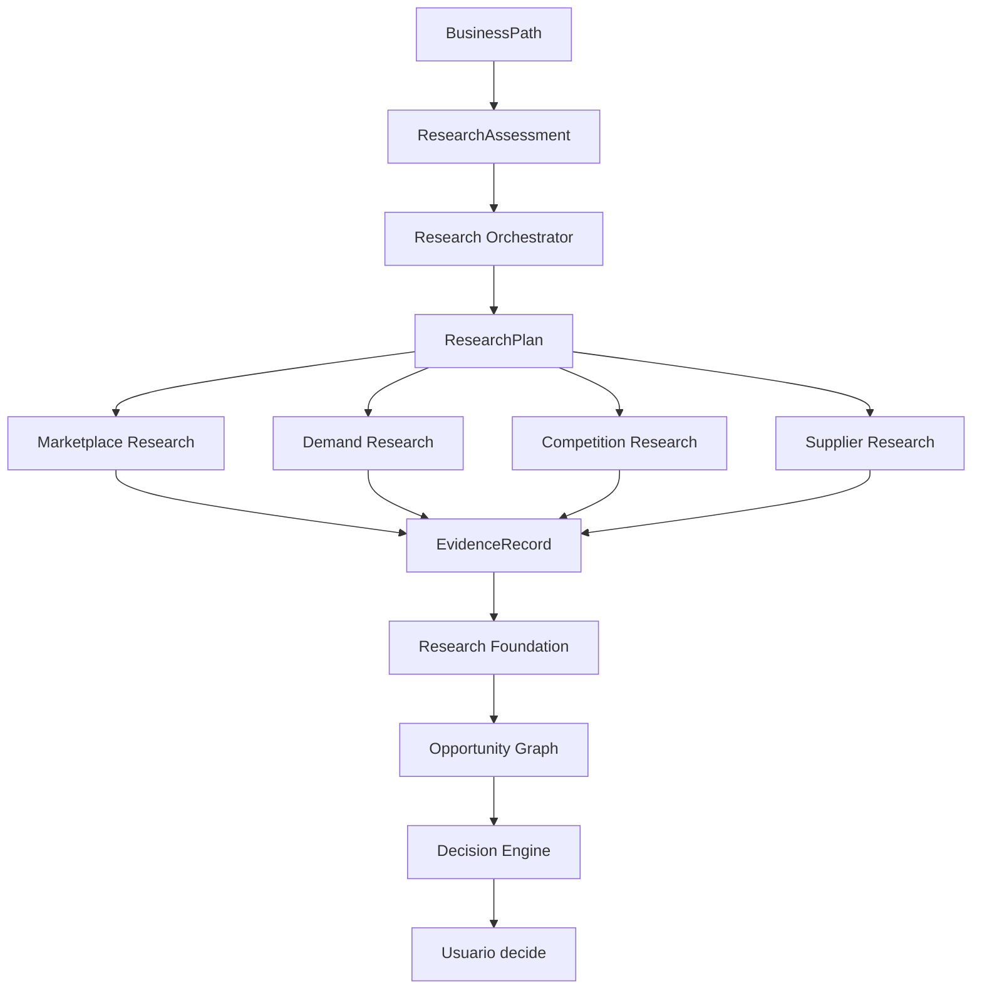
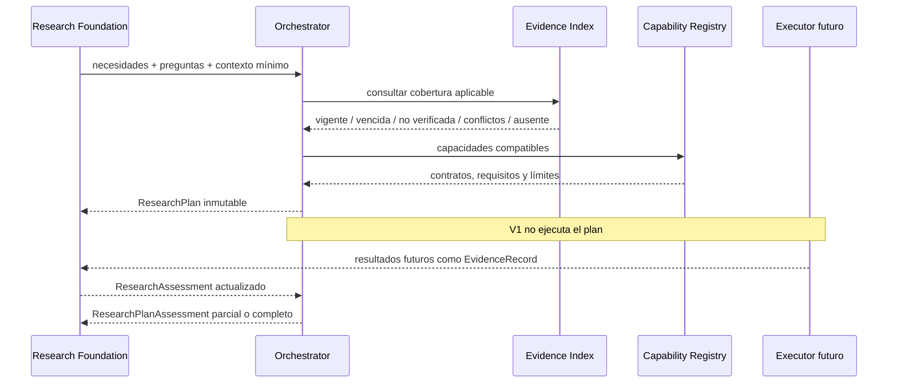
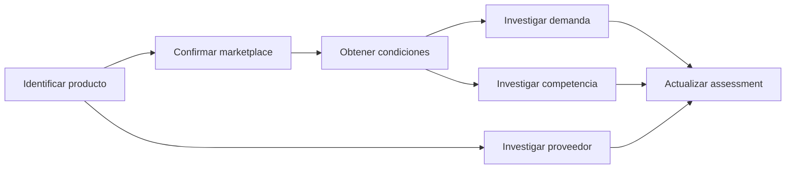

# Research Orchestration Architecture

- **Estado:** propuesta para aprobación
- **Versión:** 1.0
- **Fecha:** 2026-08-14

## 1. Propósito

Research Orchestration transforma necesidades explícitas de investigación en
un plan coordinado, trazable e idempotente. No investiga ni interpreta el
mercado: decide qué trabajo falta, qué evidencia puede reutilizarse y qué
capacidad genérica podría realizar cada tarea.



## 2. Responsabilidades

El Orchestrator:

1. consume `ResearchNeed`, `ResearchQuestion`, `ResearchAssessment` y contexto;
2. compara cobertura requerida con evidencia disponible;
3. identifica evidencia reutilizable, vencida, no verificada o conflictiva;
4. crea tareas únicamente para brechas reales;
5. asigna tareas a capacidades compatibles por contrato;
6. expresa dependencias como un DAG;
7. determina tareas listas, bloqueadas o paralelizables;
8. conserva fallos parciales y resultados válidos;
9. produce un assessment del plan sin recomendaciones comerciales.

## 3. No-responsabilidades

No navega Internet, consulta APIs, hace scraping, calcula demanda, evalúa
proveedores, conoce marketplaces concretos, recalcula finanzas, produce
Opportunity Score, recomienda comprar o invertir, modifica decisiones, ejecuta
workflows ni persiste información.

## 4. Flujo completo



## 5. Conceptos propuestos

### ResearchPlan — aprobado

Snapshot inmutable de planificación. Contiene `plan_id` semántico, objetivo de
investigación, contexto versionado, tareas, dependencias, evidencia reutilizada,
brechas, warnings, propietario lógico, proyecto, fecha y versión del planner.
No es una cola ni el registro canónico de evidencia.

### ResearchTask — aprobado

Unidad semántica de trabajo: pregunta, sujeto, cobertura requerida, capability,
inputs mínimos, evidencia previa, dependencias, prioridad explicada, coste
esperado declarado, restricciones y freshness requerido. No contiene secretos.

### ResearchCapability — aprobado como port

Contrato genérico que declara `capability_id`, categorías soportadas, regiones y
contextos aceptados, esquema de request/result, requisitos de autorización,
limitaciones, coste esperado, rate-limit conocido y versión. La implementación
vive fuera del Core.

### ResearchCapabilityRequest / Result — aprobados

Request es el contexto mínimo para ejecutar una tarea. Result devuelve estado,
`EvidenceRecord` producidos, faltantes, warnings, error tipado, trazabilidad y
versión de capability. Result no puede entregar conclusiones comerciales como
hechos.

### ResearchTaskDependency — aprobado

Arista `prerequisite_task_id → dependent_task_id`, con razón verificable y tipo
(`requires_output`, `requires_subject`, `requires_authorization`). Permite validar
ciclos y bloqueos sin introducir un workflow engine.

### ResearchExecutionContext — aprobado

Snapshot mínimo de usuario/proyecto/región/marketplace/sujeto y autorizaciones
declaradas. Contiene referencias, no tokens. Separa contexto público de privado.

### ResearchPlanAssessment — aprobado

Read model del plan: cobertura, estados, evidencia aceptada, conflictos, tareas
listas/bloqueadas/fallidas, faltantes y limitaciones. No decide ni recomienda.

### ResearchPriority — aprobado como categoría explicada

`blocking`, `high`, `normal`, `deferred`. Cada categoría exige razones explícitas;
no existe suma ponderada ni score.

### ResearchTaskState — aprobado

`pending`, `ready`, `in_progress`, `completed`, `partial`, `blocked`, `failed`,
`cancelled`, `superseded`. Son estados operativos, no juicios sobre la oportunidad.

### ResearchFailure — aprobado

Error tipado, capability, tarea, momento, etapa, mensaje seguro, retryable,
datos parciales conservados y referencia técnica sanitizada.

### ResearchRetryPolicy — diferido

El Core solo necesita saber si un fallo es retryable. Backoff, intentos y cuotas
pertenecerán al executor/configuración, no al Orchestrator V1.

### ResearchCoverage — aprobado

Describe qué pregunta, sujeto, región, marketplace, periodo y EvidenceType cubre
una evidencia. Evita reutilización por coincidencias superficiales.

## 6. Estados y ciclos de vida

Plan: `draft → ready → in_progress → completed|partial|blocked|failed|cancelled`.

- `completed`: todas las tareas requeridas terminaron con cobertura suficiente.
- `partial`: existe evidencia válida pero quedan tareas pendientes o fallidas.
- `blocked`: ninguna tarea requerida puede avanzar por dependencias o permisos.
- `failed`: falló el plan sin evidencia útil recuperada.
- `pending`: todavía no iniciado; no equivale a bloqueo.

Una tarea fallida no convierte automáticamente el plan en fallido.

## 7. Identidad e idempotencia

- `semantic_plan_id`: UUID5 de objetivo/BusinessPath, preguntas canónicas,
  cobertura requerida, contexto relevante y versión del planner.
- `task_id`: UUID5 de need/question, capability, sujeto, región, marketplace,
  periodo, cobertura y versión semántica.
- `execution_id`: identidad opaca nueva para cada intento real.

Fechas de planificación, orden de entrada y etiquetas visuales no cambian la
identidad semántica. Cambiar región, sujeto, marketplace, periodo, requisito de
evidencia o versión material sí la cambia. Una actualización legítima conserva
el mismo `task_id` y crea un `execution_id` nuevo con historial.

## 8. Dependencias

El plan valida que todo dependency ID exista, rechaza self-dependencies y ciclos,
y calcula determinísticamente:

- tareas sin precondiciones (`ready`);
- tareas bloqueadas;
- niveles topológicos paralelizables;
- rutas críticas declarativas.



## 9. Concurrencia futura

Las tareas del mismo nivel topológico podrán ejecutarse en paralelo. V1 no usa
async, threads, workers ni colas. La reconciliación futura ordenará resultados
por identidad de evidencia, no por llegada. Repetir un mismo `execution_id` será
idempotente; ejecuciones distintas conservarán evidencia histórica distinta.

## 10. Reutilización de evidencia

Una evidencia solo cubre una tarea si coincide exactamente en:

- pregunta/categoría y sujeto;
- región y marketplace cuando apliquen;
- producto/escenario cuando apliquen;
- periodo y vigencia;
- EvidenceType requerido;
- verificación mínima;
- ausencia de conflicto activo no resuelto.

| Evidencia | Acción del planificador |
|---|---|
| Vigente, verificada y aplicable | Reutilizar; no crear consulta redundante |
| Verificada pero vencida | Conservar y crear tarea de actualización |
| Vigente no verificada | Usar como contexto; mantener tarea de verificación |
| Conflictiva | Conservar todas; crear tarea de resolución si bloquea |
| Ausente | Crear tarea |

La reutilización nunca modifica ni borra EvidenceRecord anteriores.

## 11. Freshness

El Orchestrator consume `FreshnessStatus`; no determina vencimientos. Cada
capability, adaptador o configuración versionada declarará la política aplicable
a precio, tarifa, restricción, demanda, competencia, proveedor o política. Una
política desconocida produce freshness desconocida y una limitación explícita.

## 12. Fallos parciales

Cada CapabilityResult conserva evidencia válida aunque incluya fallo. El plan
agrega por tarea, nunca con una transacción “todo o nada”. Ejemplo:

```text
Marketplace: completed
Demand: completed
Competition: failed (retryable)
Supplier: pending
Plan: partial
```

La evidencia de Marketplace y Demand permanece disponible.

## 13. Conflictos

El Orchestrator consume `EvidenceConflict`. No elige ganador. Si el conflicto
impide cubrir una necesidad blocking, crea una tarea explícita de resolución;
si no bloquea, lo conserva como warning y reduce cobertura/confianza declarada.

## 14. Prioridad explicable

Orden lexicográfico, sin pesos ocultos:

1. bloquea una decisión o dependencia;
2. habilita más tareas dependientes;
3. evidencia vencida o ausente frente a contexto parcial;
4. importancia declarada de ResearchNeed;
5. menor coste/restricción cuando los criterios anteriores empatan;
6. `task_id` como desempate técnico estable.

Cada tarea conserva las razones que determinaron su posición. El orden no
implica rentabilidad ni probabilidad de éxito.

## 15. Costo futuro

ResearchCapability puede declarar moneda/unidades, rango esperado, latencia,
cuota, rate limit, autorización requerida y posibilidad de caché. Son metadatos
para consentimiento y planificación, no billing. Coste desconocido permanece
desconocido; nunca se asume cero.

## 16. Seguridad y privacidad

- `owner_scope_id` y `project_id` separan planes y evidencia.
- Requests contienen el mínimo contexto.
- Tokens, passwords, API keys, authorization codes y PII no entran en planes.
- Errores y logs se sanitizan.
- Evidencia privada/de cuenta solo se reutiliza dentro del scope autorizado.
- Evidencia pública puede reutilizarse únicamente con procedencia, licencia,
  región, vigencia y política explícita.
- Compartir un resultado no autoriza recorrer el resto del grafo.

## 17. Relación con Research Foundation

Research Foundation es canónica para Investigation, necesidades, preguntas,
EvidenceRecord, Findings, conflictos y assessment. El Orchestrator consume esos
contratos y devuelve planes; no reemplaza ni muta la investigación.

## 18. Relación con Opportunity Graph

El grafo proyecta posteriormente investigaciones y evidencia. No ejecuta tareas,
no almacena el plan canónico y no se usa para decidir scheduling.

## 19. Relación con Decision Engine

Decision Engine podrá consumir `ResearchPlanAssessment`, pero mantiene sus
estados actuales. El Orchestrator no genera `probar`, no recomienda compras y
no altera la decisión humana.

## 20. Extensibilidad

Un registry de puertos permite añadir Marketplace, Demand, Competition,
Supplier, Pricing, Regulatory, Logistics, Trend, Product o Regional Research sin
modificar el planificador. Cada capability declara categorías y contratos; los
adaptadores concretos quedan fuera del Core mediante capa anticorrupción.

## 21. Ejemplos completos

### Evidencia reutilizable

Demand DATA, VERIFIED, CURRENT y mismo producto/región/periodo: la tarea queda
cubierta y se registra la evidencia reutilizada.

### Actualización necesaria

Una tarifa oficial VERIFIED pero EXPIRED permanece adjunta y se crea una tarea
Marketplace Research para actualizarla.

### Ejecución paralela futura

Con producto y marketplace confirmados, Demand y Competition quedan `ready` en
el mismo nivel; Supplier puede estar listo en paralelo si no depende del canal.

### Fallo parcial

Competition falla, Supplier queda pendiente y Marketplace/Demand completan. El
plan es `partial`, conserva evidencia y expone el siguiente trabajo pendiente.

## 22. Riesgos arquitectónicos

- comparar cobertura de manera demasiado superficial;
- convertir prioridad en score implícito;
- filtrar secretos insuficientemente;
- crear ciclos de dependencias;
- reutilizar evidencia privada fuera de scope;
- confundir fallo técnico con evidencia negativa;
- dejar que capabilities cambien semánticas del Core;
- explosión de tareas por identidad mal definida.

## 23. Decisiones humanas pendientes

1. política concreta de freshness por capability;
2. catálogo inicial y criterios de habilitación de capabilities;
3. límites de coste y consentimiento por consulta;
4. reglas de reintento y cancelación;
5. clasificación legal de evidencia pública/privada;
6. retención y eliminación de ejecuciones;
7. primer executor y tecnología de persistencia;
8. qué datos pueden reutilizarse globalmente;
9. alcance multiusuario y modelo de autorización.

## 24. Implementación incremental sugerida

1. Contratos inmutables de Plan, Task, Coverage, Dependency y Assessment.
2. Planificador puro con validación DAG y evidencia en memoria.
3. Registry de fakes para capabilities y fallos parciales.
4. Ejecutor síncrono local sin red.
5. Persistencia y scopes después de ADR de seguridad.
6. Primera capability real solo con fuentes oficiales y revisión humana.
7. Concurrencia, costes y retry policy cuando exista necesidad demostrada.

## Compatibilidad

Esta arquitectura conserva ADR-001 a ADR-023: Opportunity sigue siendo centro de
evaluación; BusinessPath no se muta; EvidenceRelation mantiene trazabilidad;
Opportunity Graph sigue no canónico; Goal-to-Business no investiga; no hay scores
opacos; Recommendation y Decision permanecen separadas; matching sigue opt-in.

