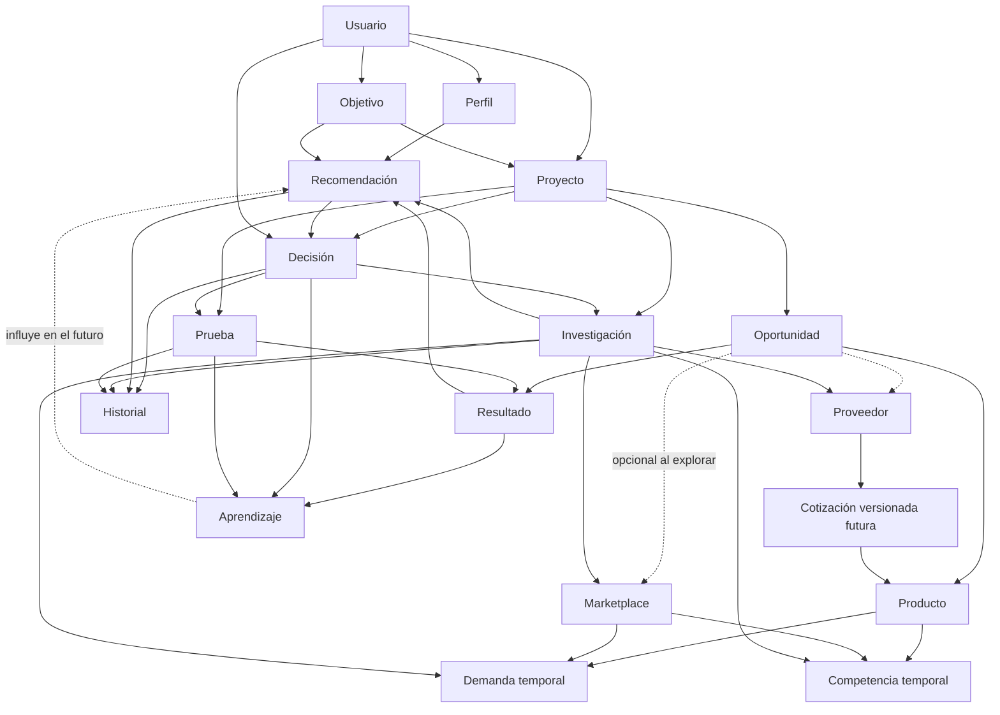
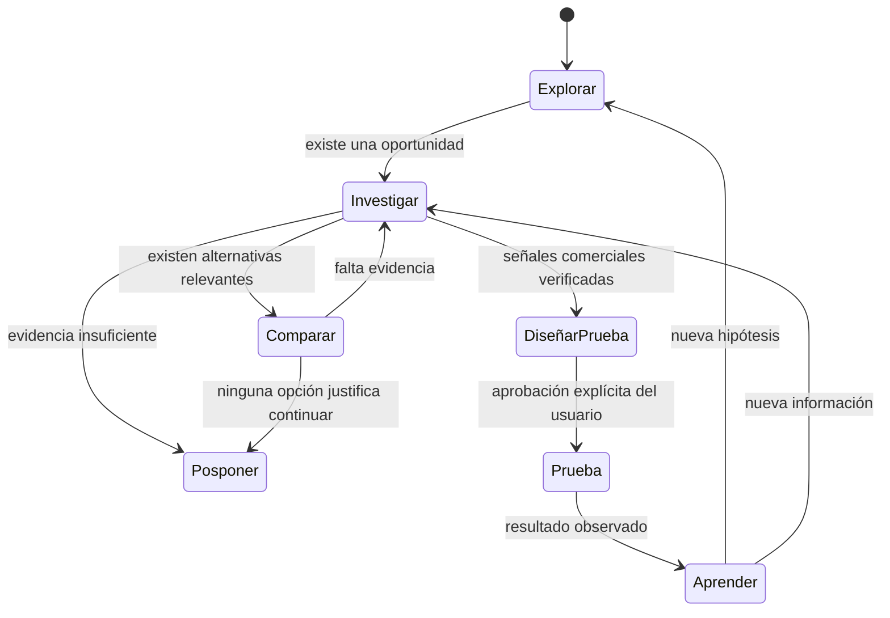

# Oriva — Modelo de dominio oficial

**Estado:** aprobado para documentación

**Versión:** 1.0

**Alcance:** arquitectura de dominio; no define todavía clases ni persistencia

## 1. Propósito

Este documento define el lenguaje y las relaciones estables con los que Oriva
acompañará al usuario desde una idea hasta una decisión informada y su posterior
aprendizaje. El modelo es independiente de la interfaz, las fórmulas, Amazon,
las fuentes externas y la tecnología de almacenamiento.

```text
Objetivo → Proyecto → Oportunidad → Investigación → Resultado
         → Recomendación → Decisión → Prueba → Aprendizaje
```

## 2. Lenguaje del dominio

### Usuario

- **Propósito:** persona que utiliza Oriva y conserva la decisión final.
- **Atributos:** identificador, nombre, correo, idioma, zona horaria, estado y
  fecha de creación.
- **Relaciones:** posee un Perfil, Objetivos, Proyectos, Decisiones, Historial y
  Aprendizajes.
- **Ciclo de vida:** invitado, activo, suspendido y cerrado.
- **Responsabilidades:** propiedad de la información, autorización de acciones
  y confirmación de decisiones.
- **Motores:** Decision Engine y Learning Engine.

### Perfil

- **Propósito:** contexto declarado que adapta explicaciones y recomendaciones.
- **Atributos:** experiencia, etapa del negocio, presupuesto general, tolerancia
  al riesgo, categorías y preferencias.
- **Relaciones:** pertenece a un Usuario e influye en Objetivos, Recomendaciones
  y Decisiones.
- **Ciclo de vida:** se crea con el usuario y cambia únicamente mediante datos
  declarados o confirmados.
- **Responsabilidades:** aportar contexto sin reemplazar los datos del Proyecto.
- **Motores:** Decision, Insight y Learning Engines.

### Objetivo

- **Propósito:** expresar qué quiere conseguir el usuario y cómo reconocerá el
  avance.
- **Atributos:** tipo, descripción, presupuesto, horizonte, criterios de éxito,
  restricciones, prioridad y estado.
- **Relaciones:** pertenece al Usuario y origina uno o varios Proyectos.
- **Ciclo de vida:** borrador, activo, pausado, alcanzado o cancelado.
- **Responsabilidades:** orientar evaluaciones y evitar recomendaciones sin una
  intención definida.
- **Motores:** Decision y Learning Engines.

### Proyecto

- **Propósito:** agrupar el trabajo de una iniciativa concreta.
- **Atributos:** nombre, descripción, objetivo, presupuesto, marketplace
  previsto, configuración, estado y fechas.
- **Relaciones:** pertenece al Usuario y contiene Oportunidades,
  Investigaciones, Decisiones, Pruebas y Resultados.
- **Ciclo de vida:** borrador, exploración, investigación, validación,
  operación, pausado o cerrado.
- **Responsabilidades:** delimitar contexto y conservar continuidad.
- **Motores:** todos los motores operan dentro de su contexto.

### Producto

- **Propósito:** representar el artículo evaluado sin ligarlo a un canal,
  proveedor o precio concreto.
- **Atributos:** nombre, descripción, marca, categoría, variante,
  características e identificadores externos como SKU, ASIN o UPC.
- **Relaciones:** puede participar en varias Oportunidades, Marketplaces,
  investigaciones de Proveedor, observaciones de Demanda y Competencia.
- **Ciclo de vida:** detectado, identificado, verificado e inactivo.
- **Responsabilidades:** identidad consistente y deduplicación.
- **Motores:** Marketplace, Supplier, Demand y Competition Engines.

### Oportunidad

- **Propósito:** posibilidad de comercializar un Producto bajo condiciones
  específicas. Es la entidad central de evaluación.
- **Atributos:** producto, marketplace opcional, proveedor potencial, supuestos
  financieros, métricas calculadas, Opportunity Score, clasificación, estado,
  fecha y vigencia.
- **Relaciones:** pertenece a un Proyecto; recibe Investigaciones y Resultados;
  puede generar Recomendaciones, Decisiones y una Prueba.
- **Ciclo de vida:** detectada, analizada, investigando, comparando, candidata,
  descartada, pospuesta o en prueba.
- **Responsabilidades:** reunir referencias y resultados sin alterar la
  evidencia que los originó.
- **Motores:** Financial, Opportunity, Insight, Decision, Supplier,
  Marketplace, Demand y Competition Engines.

Una Oportunidad puede existir sin Marketplace durante exploración e
investigación. En ese caso, su contexto comercial está incompleto, la confianza
debe reducirse y no puede avanzar a una prueba. Cuando se seleccione un
Marketplace, este debe quedar identificado explícitamente junto con región,
moneda y vigencia de sus condiciones.

El Opportunity Score es únicamente evidencia financiera parcial, estimada a
partir de ROI, margen y ganancia. No demuestra demanda, competencia ni viabilidad
comercial y nunca habilita por sí solo una compra, inversión o prueba.

### Investigación

- **Propósito:** organizar preguntas, evidencia y hallazgos para reducir
  incertidumbre.
- **Atributos:** pregunta, tema, fuente, fecha, vigencia, confianza, hallazgo,
  estado de verificación y limitaciones.
- **Relaciones:** pertenece a un Proyecto u Oportunidad y puede estudiar
  Producto, Proveedor, Marketplace, Demanda o Competencia.
- **Ciclo de vida:** pendiente, en curso, parcial, verificada, desactualizada o
  descartada.
- **Responsabilidades:** separar evidencia de interpretación y declarar lo que
  todavía se desconoce.
- **Motores:** Decision, Insight, Supplier, Marketplace, Demand y Competition
  Engines.

### Resultado

- **Propósito:** salida observable de un análisis, investigación o prueba.
- **Atributos:** tipo, valores, unidad, fuente, fecha, contexto, confianza,
  naturaleza —dato, estimación o supuesto—, versión y limitaciones.
- **Relaciones:** pertenece a una Oportunidad, Investigación, Decisión o Prueba;
  alimenta dashboards, insights y recomendaciones.
- **Ciclo de vida:** generado, validado, utilizado, reemplazado o desactualizado.
- **Responsabilidades:** inmutabilidad, trazabilidad y distinción entre
  estimaciones financieras y resultados comerciales observados.
- **Motores:** todos los motores consumidores de evidencia.

### Recomendación

- **Propósito:** orientación explicable producida por un motor; nunca ejecuta ni
  impone una decisión.
- **Atributos:** estado sugerido, mensaje, evidencia favorable, riesgos, datos
  faltantes, siguiente paso, alternativas, condiciones, confianza, reglas,
  limitaciones, fecha y versión del motor.
- **Relaciones:** se refiere a un Proyecto u Oportunidad, consume Resultados e
  Investigaciones y puede ser considerada por una Decisión.
- **Ciclo de vida:** generada, presentada, considerada, aceptada, rechazada,
  reemplazada o expirada.
- **Responsabilidades:** explicar el porqué, distinguir datos de supuestos y no
  prometer rentabilidad.
- **Motores:** Decision, Insight y Learning Engines.

### Decisión

- **Propósito:** registrar la elección humana y el contexto conocido al tomarla.
- **Atributos:** estado elegido, justificación, recomendación considerada,
  evidencia, riesgos aceptados, datos faltantes, fecha, responsable y versión.
- **Relaciones:** pertenece a Usuario y Proyecto; puede referirse a una
  Oportunidad y originar Investigación o Prueba.
- **Ciclo de vida:** pendiente, tomada, en ejecución, revisada, sustituida o
  cerrada.
- **Responsabilidades:** preservar control humano y trazabilidad.
- **Motores:** Decision y Learning Engines.

### Proveedor

- **Propósito:** identificar una posible fuente de abastecimiento.
- **Atributos permanentes:** identidad, nombre, ubicación, canales de contacto,
  estado y evidencia de verificación.
- **Relaciones:** puede ofrecer Productos, participar en Oportunidades y ser
  objeto de Investigación.
- **Ciclo de vida:** descubierto, contactado, verificado, activo, rechazado o
  inactivo.
- **Responsabilidades:** identidad y trazabilidad de verificación; no conservar
  condiciones comerciales cambiantes como propiedades permanentes.
- **Motores:** Supplier, Decision y Learning Engines.

Precios, MOQ, envío, plazos, condiciones de pago y demás condiciones comerciales
se modelarán mediante **Cotizaciones versionadas**. Cada cotización deberá
referenciar Proveedor, Producto, moneda, región, fecha, vigencia, fuente y
condiciones. Cambiar una cotización no modificará las anteriores.

### Marketplace

- **Propósito:** mercado y canal donde podría evaluarse o venderse un Producto.
- **Atributos:** nombre, país, región, moneda, categorías y referencias a reglas
  versionadas.
- **Relaciones:** contextualiza Oportunidades, Demanda y Competencia.
- **Ciclo de vida:** disponible, configurado, activo, restringido o inactivo.
- **Responsabilidades:** aislar particularidades del canal.
- **Motores:** Marketplace, Financial, Demand, Competition y Decision Engines.

Marketplace es opcional mientras el usuario explora o investiga. Es obligatorio
antes de comparar señales comerciales específicas o diseñar una prueba.

### Demanda

- **Propósito:** observación temporal sobre interés comercial; no representa una
  propiedad permanente del Producto.
- **Atributos:** marketplace, región, periodo, indicadores, fuente, fecha,
  vigencia, tendencia, confianza y limitaciones.
- **Relaciones:** vincula Producto y Marketplace y aporta evidencia a una
  Oportunidad.
- **Ciclo de vida:** observada, validada parcialmente, vigente, desactualizada o
  reemplazada.
- **Responsabilidades:** expresar señales acotadas sin afirmar ventas futuras.
- **Motores:** Demand, Insight y Decision Engines.

### Competencia

- **Propósito:** observación temporal de las condiciones competitivas.
- **Atributos:** marketplace, región, periodo, fuente, vigencia, competidores,
  ofertas, rango de precios, concentración, confianza y limitaciones.
- **Relaciones:** vincula Producto y Marketplace y aporta evidencia a una
  Oportunidad.
- **Ciclo de vida:** observada, analizada, vigente, desactualizada o reemplazada.
- **Responsabilidades:** conservar observaciones verificables sin inferir
  comportamiento futuro.
- **Motores:** Competition, Insight y Decision Engines.

Demanda y Competencia siempre deben identificar marketplace, región, periodo,
fuente y vigencia. No pueden trasladarse implícitamente entre mercados, regiones
o periodos diferentes.

### Prueba

- **Propósito:** experimento pequeño y limitado para validar supuestos.
- **Atributos:** hipótesis, oportunidad, presupuesto máximo, duración, tamaño,
  condiciones de inicio, métricas de éxito, criterios de interrupción, riesgo y
  resultado observado.
- **Relaciones:** pertenece a un Proyecto, valida una Oportunidad, requiere una
  Decisión humana y produce Resultados y Aprendizajes.
- **Ciclo de vida:** propuesta, diseñada, aprobada por el usuario, en ejecución,
  completada, interrumpida o cancelada.
- **Responsabilidades:** limitar exposición y definir éxito o fracaso antes de
  comenzar.
- **Motores:** Decision Engine futuro y Learning Engine.

Una Prueba nunca se habilita únicamente por ROI, margen, ganancia, presupuesto u
Opportunity Score.

### Historial

- **Propósito:** secuencia inmutable de eventos relevantes.
- **Atributos:** entidad, evento, fecha, actor, estados anterior y posterior,
  motivo, referencias y versión del motor.
- **Relaciones:** registra cambios de Proyectos, Oportunidades,
  Investigaciones, Recomendaciones, Decisiones y Pruebas.
- **Ciclo de vida:** solo se agregan eventos; no se reescribe.
- **Responsabilidades:** auditoría y reconstrucción del contexto.
- **Motores:** Learning y Decision Engines.

### Aprendizaje

- **Propósito:** conclusión confirmable surgida de comparar expectativas con
  resultados observados.
- **Atributos:** hipótesis, evidencia, resultado esperado y observado,
  conclusión, alcance, confianza, aplicabilidad, fecha y origen.
- **Relaciones:** proviene de Decisiones, Pruebas, Resultados e Historial e
  influye en recomendaciones futuras.
- **Ciclo de vida:** candidato, revisado, confirmado, aplicado, reemplazado o
  invalidado.
- **Responsabilidades:** conservar evidencia y evitar generalizaciones sin
  respaldo.
- **Motores:** Learning y Decision Engines.

## 3. Objetos de valor

Los siguientes conceptos no requieren identidad propia y deben ser inmutables:

- Dinero y moneda.
- Porcentaje.
- Presupuesto.
- Periodo y vigencia.
- Fuente de datos.
- Evidencia.
- Nivel de confianza.
- Riesgo.
- Métrica financiera.
- Clasificación.
- Identificador externo.
- Versión de reglas.
- Naturaleza de información: dato, estimación o supuesto.

`Cotización` se diseñará en una fase posterior como entidad versionada, no como
objeto de valor embebido en Proveedor.

## 4. Diagrama del dominio



## 5. Core permanente y capacidades opcionales

### Core permanente

- Usuario.
- Perfil.
- Objetivo.
- Proyecto.
- Oportunidad.
- Producto.
- Investigación.
- Resultado.
- Recomendación.
- Decisión.
- Historial.
- Aprendizaje.

### Capacidades opcionales

- Proveedor.
- Marketplace.
- Demanda.
- Competencia.
- Prueba.
- Cotización versionada futura.

Su ausencia no rompe el Core, pero se registra como información faltante, reduce
la confianza y limita los estados que puede sugerir el Decision Engine.

## 6. Agregados propuestos

- **Usuario:** Usuario, Perfil y referencias a Objetivos y Proyectos.
- **Proyecto:** Proyecto, objetivo asociado, configuración y referencias a
  Oportunidades.
- **Oportunidad:** Oportunidad y referencias a Producto, Marketplace, Proveedor,
  Investigaciones y Resultados.
- **Investigación:** preguntas, evidencias, fuentes, vigencia y hallazgos.
- **Decisión:** recomendación considerada, evidencia, elección humana y riesgos.
- **Prueba:** hipótesis, límites, criterios y resultados observados.

Historial consume eventos de los agregados, pero no controla sus invariantes.

## 7. Invariantes

1. Una Recomendación nunca equivale a una Decisión.
2. Toda Decisión identifica al usuario responsable.
3. Todo Resultado declara si es dato, estimación o supuesto.
4. Toda evidencia conserva fuente, fecha, vigencia y confianza.
5. Las métricas financieras no demuestran demanda ni ventas.
6. Opportunity Score y presupuesto no autorizan una Prueba.
7. Una Prueba requiere condiciones verificadas y aprobación humana.
8. El Historial no se reescribe.
9. Cambiar una fórmula produce un Resultado nuevo; no altera el anterior.
10. Un Aprendizaje conserva evidencia, alcance y confianza.
11. La ausencia de información se representa; nunca se inventa.
12. Marketplace, moneda, región y periodo no se asumen implícitamente.
13. Una cotización nueva no reemplaza retroactivamente cotizaciones anteriores.
14. Demanda y Competencia pierden vigencia con el tiempo.
15. El usuario conserva la decisión final.

## 8. Evolución compatible

- Identificadores internos estables e independientes de fuentes externas.
- Contratos con versión de esquema, reglas y motor.
- Cambios aditivos como estrategia predeterminada.
- Campos obsoletos con periodo de compatibilidad y migración explícita.
- Resultados, recomendaciones, cotizaciones y eventos históricos inmutables.
- Integraciones encapsuladas mediante adaptadores anticorrupción.
- Capacidades opcionales que no vuelven obligatorio un proveedor externo.
- Migraciones repetibles para los datos persistidos.

## 9. Separación arquitectónica

```text
UI
↓
Application
↓
Motores
↓
Modelo de dominio
↑
Adaptadores anticorrupción
↑
Fuentes de datos
```

- **UI:** presenta información y recibe acciones; no calcula ni decide.
- **Application:** coordina casos de uso, transacciones y autorizaciones.
- **Motores:** aplican reglas versionadas y producen resultados explicables.
- **Dominio:** protege lenguaje, ciclos de vida e invariantes sin depender de
  frameworks.
- **Adaptadores:** traducen formatos externos, registran procedencia y contienen
  los cambios de las integraciones.
- **Fuentes:** suministran información; nunca deciden si una oportunidad conviene.

## 10. Relación con motores

| Motor | Consume | Produce |
|---|---|---|
| Financial | Oportunidad y supuestos | Resultado financiero |
| Dashboard | Resultados | Resumen agregado |
| Opportunity | Resultados financieros | Score y clasificación estimados |
| Insight | Resultados, dashboard y filtros | Fortalezas, riesgos y advertencias |
| Decision | Objetivo, Perfil, Oportunidad, Investigación y Resultados | Recomendación explicable |
| Supplier | Producto, Proveedor y Cotizaciones | Evaluación de abastecimiento |
| Marketplace | Producto y Marketplace | Condiciones y restricciones |
| Demand | Producto, Marketplace y observaciones temporales | Evidencia de demanda |
| Competition | Producto, Marketplace y observaciones temporales | Evidencia competitiva |
| Learning | Decisiones, Pruebas, Resultados e Historial | Aprendizajes confirmables |

## 11. Flujo de decisión



En la fase financiera actual están habilitados `explorar`, `investigar`,
`comparar` y `posponer`. `Probar` queda reservado para cuando existan señales
comerciales suficientes, condiciones verificadas y aprobación humana.

## 12. Registros de decisiones relacionados

- [ADR-001: Oportunidad como entidad central](../adr/ADR-001-opportunity-central-entity.md)
- [ADR-002: Recomendación y Decisión separadas](../adr/ADR-002-recommendation-decision-separation.md)
- [ADR-003: Resultados inmutables y versionados](../adr/ADR-003-immutable-versioned-results.md)
- [ADR-004: Core independiente de Amazon](../adr/ADR-004-core-independence.md)
- [ADR-005: Adaptadores anticorrupción](../adr/ADR-005-anticorruption-adapters.md)
- [ADR-006: Evidencia trazable](../adr/ADR-006-evidence-traceability.md)
