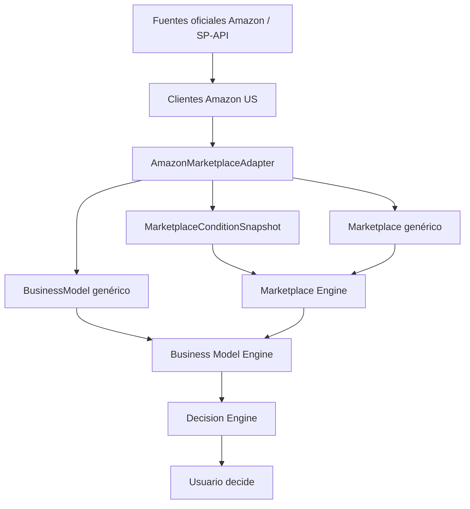

# Oriva — Amazon US Integration Design

**Estado:** propuesta para aprobación; sin integración de producción

**Sprint:** 26 — investigación técnica y arquitectura

**Región objetivo:** Estados Unidos (`US`)

**Marketplace externo:** Amazon.com (`ATVPDKIKX0DER`)

**Fecha de consulta:** 2026-08-09

**Fuentes:** exclusivamente documentación oficial de Amazon

## 1. Propósito y límites

Este documento diseña el primer adaptador real de marketplace de Oriva. Amazon
US es el caso inicial, no una dependencia del Core. La futura integración debe
traducir fuentes oficiales y respuestas de SP-API al lenguaje genérico aprobado
en los Sprints 24 y 25.

Este sprint no:

- llama APIs, solicita credenciales ni persiste datos de Amazon;
- calcula ROI, margen, ganancia u Opportunity Score;
- recomienda un modelo operativo;
- codifica FBA, FBM, ASIN o identificadores de Amazon dentro de `domain/`;
- asume que una tarifa, política o restricción pública continúa vigente sin
  fecha, fuente y verificación.

## 2. Fuentes oficiales consultadas

| Tema | Fuente oficial | Uso previsto |
|---|---|---|
| SP-API y onboarding | [Onboarding as a Developer](https://developer-docs.amazon.com/sp-api/docs/onboarding-overview) | Tipos de aplicación, OAuth, roles y autorización |
| Registro | [SP-API Registration Overview](https://developer-docs.amazon.com/sp-api/lang-en_EN/docs/sp-api-registration-overview) | Requisitos de alta, políticas y publicación |
| Conexión y tokens | [Connect to the SP-API](https://developer-docs.amazon.com/sp-api/lang-zh_CN/docs/connecting-to-the-selling-partner-api) | LWA, access token, refresh token y RDT |
| Cambio de autenticación | [SP-API no longer requires AWS IAM or Signature V4](https://developer-docs.amazon.com/sp-api/changelog/sp-api-will-no-longer-require-aws-iam-or-aws-signature-version-4) | Evitar arquitectura obsoleta basada en SigV4 |
| Roles | [Selling Partner API Roles](https://developer-docs.amazon.com/sp-api/docs/direct-to-consumer-shipping-restricted-role) | Menor privilegio y operaciones autorizadas |
| Credenciales | [Safeguarding Sensitive Credentials](https://developer-docs.amazon.com/sp-api/lang-de_DE/docs/safeguarding-sensitive-credentials) | Vault cifrado, rotación y prohibición de secretos en código |
| Políticas de datos | [Policies and Agreements](https://developer-docs.amazon.com/sp-api/lang-es_ES/docs/policies-and-agreements) | DPP, AUP y Solution Provider Agreement vigentes |
| Marketplace US | [Marketplace IDs](https://developer-docs.amazon.com/sp-api/lang-zh/docs/marketplace-ids) | Referencia externa `ATVPDKIKX0DER`, región US |
| Catálogo | [Catalog Items API](https://developer-docs.amazon.com/sp-api/docs/catalog-items-api) | Atributos, dimensiones, identificadores, categoría e imágenes |
| Restricciones | [Listings Restrictions API](https://developer-docs.amazon.com/sp-api/lang-es_ES/docs/listings-restrictions-api-v2021-08-01-model) | Restricciones por ASIN, condición, vendedor y marketplace |
| Estimación de tarifas | [Product Fees API](https://developer-docs.amazon.com/sp-api/lang-zh_CN/docs/product-fees-api) | Estimaciones por ASIN/SKU; no son costos garantizados |
| Inventario FBA | [FBA Inventory API](https://developer-docs.amazon.com/sp-api/lang-en_EN/docs/fba-inventory-api) | Cantidades FBA por cuenta y marketplace |
| Reportes FBA | [FBA Reports](https://developer-docs.amazon.com/sp-api/lang-en_EN/docs/report-type-values-fba) | Fee preview, almacenamiento, edad e inventario |
| Métricas de venta | [Sales API — order metrics](https://developer-docs.amazon.com/sp-api/lang-US/docs/receive-sales-performance-information) | Métricas agregadas de la cuenta autorizada |
| Tarifas públicas US | [Selling on Amazon pricing](https://sell.amazon.com/pricing?mons_sel_locale=en_US) | Planes y referral fees por categoría |
| FBA | [Fulfillment by Amazon](https://sell.amazon.com/fulfillment-by-amazon?mons_sel_locale=en_US) | Responsabilidades, almacenamiento, fulfillment y devoluciones |
| FBM | [Fulfilled by Merchant](https://sell.amazon.com/programs/fulfilled-by-merchant?mons_sel_locale=en_US) | Responsabilidades, envíos, devoluciones y atención al cliente |
| Devoluciones FBM | [Seller-fulfilled customer returns](https://sell.amazon.com/blog/manage-customer-returns) | Flujo US de devoluciones y costos según motivo |
| Categorías y políticas | [Seller policies](https://sell.amazon.com/blog/selling-policies?mons_sel_locale=en_US) y [FAQ](https://sell.amazon.com/learn/faq?mons_sel_locale=en_US) | Aprobaciones y productos restringidos |
| Límites | [Listings Restrictions rate limits](https://developer-docs.amazon.com/sp-api/lang-tr_TR/docs/listings-restrictions-api-rate-limits) y [Orders rate limits](https://developer-docs.amazon.com/sp-api/lang-tr_TR/docs/orders-api-rate-limits) | Límites por operación, cuenta y aplicación |

Las páginas públicas de `sell.amazon.com` sirven como fuente oficial legible,
pero no sustituyen una respuesta autenticada cuando la condición depende de un
vendedor, producto, categoría o cuenta concreta.

## 3. Clasificación de datos necesarios

Leyenda de acceso: **Público** = documento oficial sin credenciales;
**SP-API** = autorización LWA del selling partner y rol aplicable; **Seller
Central** = condición visible en la cuenta que debe obtenerse mediante API
documentada o captura humana trazable, nunca scraping.

| Clase | Campo normalizado en Oriva | Fuente oficial primaria | Región | Acceso | Snapshot | Freshness y confianza inicial |
|---|---|---|---|---|---|---|
| A estable | Identidad externa del marketplace | Marketplace IDs | US | Público | Sí | Revalidar ante changelog; alta |
| A estable | Moneda y país | Marketplace IDs / catálogo | US, USD | Público/SP-API | Sí | Cambia raramente; alta si coinciden fuentes |
| A estable | Definición general de FBA/FBM | Páginas oficiales FBA/FBM | US | Público | Sí | Versionar por revisión editorial; media-alta |
| B frecuente | Tarifas de plan y referral fees | Pricing oficial | US | Público | Sí | Invalidar al publicarse una tabla/fecha nueva |
| B frecuente | Estimación de fees por producto | Product Fees API | US | SP-API | Sí | Válida para inputs y momento de la consulta; alta como estimación |
| B frecuente | Tarifas de fulfillment y almacenamiento | Product Fees / FBA Reports | US | SP-API | Sí | Usar cadencia declarada por el reporte; estimación |
| B frecuente | Políticas de devoluciones | Seller policies / Seller Central | US | Público/Seller Central | Sí | Revalidar antes de una decisión operativa |
| B frecuente | Capacidades y disponibilidad de programas | Seller Central / SP-API aplicable | US | Autenticado | Sí | Estado temporal; no asumir disponibilidad universal |
| C categoría | Referral fee y mínimo | Pricing oficial | US + categoría | Público | Sí | Vigencia por versión de tabla; alta |
| C categoría | Aprobación y restricciones generales | Seller policies + Listings Restrictions | US + categoría | Público/SP-API | Sí | Pública = orientación; API = vendedor/producto específico |
| C categoría | Restricciones FBA/hazmat | Políticas FBA / Listings Restrictions | US + categoría | Público/SP-API | Sí | Revalidar para producto y vendedor |
| D producto | ASIN, atributos, dimensiones, peso, product type | Catalog Items API | US + ASIN | SP-API, Product Listing | Sí | Snapshot de respuesta; confianza alta en campo devuelto |
| D producto | Elegibilidad/restricción de listing | Listings Restrictions API | US + ASIN + condición | SP-API, Product Listing | Sí | Consulta nueva antes de listar; puede cambiar por vendedor |
| D producto | Fee estimate | Product Fees API | US + ASIN/SKU + precio + fulfillment | SP-API | Sí | No garantizada; conservar request y response juntos |
| D producto | Inventario, edad y almacenamiento FBA | FBA Inventory / Reports | US + SKU/FNSKU | SP-API | Sí | Casi tiempo real o cadencia declarada por reporte |
| E vendedor | Marketplace participations y cuenta habilitada | Sellers API / autorización | Cuenta + US | SP-API | Sí | Revalidar por sesión o evento de autorización |
| E vendedor | Restricciones y aprobaciones efectivas | Listings Restrictions | Seller + ASIN + US | SP-API | Sí | No transferible entre vendedores |
| E vendedor | Costos reales, inventario y ventas | Reports, FBA Inventory, Sales API | Seller + US | SP-API | Sí | Sensible y temporal; alcance mínimo |
| F autenticado | Catálogo programático | Catalog Items | US | SP-API | Sí | No se presupone endpoint público anónimo |
| F autenticado | Tarifas estimadas | Product Fees | US | SP-API | Sí | Asociar rol, seller, request e instante |
| F autenticado | Restricciones | Listings Restrictions | US | SP-API | Sí | Asociar Product Listing role y vendedor |
| F autenticado | Inventario/reportes/métricas | FBA Inventory, Reports, Sales | US | SP-API | Sí | Guardar solo campos necesarios y permitidos |

### 3.1 Disponible sin autenticación

- definición general de Amazon US, FBA y FBM;
- marketplace ID, país y región externa;
- planes y tablas públicas de tarifas;
- orientación pública sobre categorías, restricciones y devoluciones;
- documentación de APIs, modelos, roles, sandboxes y límites publicados.

Estos datos permiten educación y preparación, no confirmar elegibilidad de un
producto o vendedor.

### 3.2 Bloqueado por autenticación o contexto del vendedor

- búsqueda y atributos programáticos del catálogo mediante SP-API;
- fee estimates por ASIN/SKU;
- restricciones efectivas de listing;
- inventario, almacenamiento y reportes FBA;
- ventas agregadas y datos de cuenta;
- capacidades, aprobaciones y condiciones particulares del vendedor.

No se diseñará scraping como sustituto. Si no existe autorización, Oriva debe
declarar `no disponible`, mostrar qué falta y degradar su confianza.

## 4. AmazonMarketplaceAdapter

El adaptador vive fuera del Core, por ejemplo en
`integrations/amazon_us/amazon_marketplace_adapter.py`. Los términos FBA, FBM,
ASIN, SKU y marketplace ID externo permanecen en esta capa.

### Responsabilidades

1. Consultar una fuente oficial mediante un cliente inyectado.
2. Adjuntar región, seller context, instante, versión de API/documento y fuente.
3. Validar el esquema externo antes de traducirlo.
4. Convertir identificadores externos en referencias, nunca en IDs internos.
5. Producir `Marketplace`, `BusinessModel` y
   `MarketplaceConditionSnapshot` genéricos.
6. Preservar valores originales en evidencia auditable y normalizar solo las
   unidades/conceptos documentados.
7. Informar datos ausentes, desactualizados, no autorizados o limitados.

### No responsabilidades

- fórmulas financieras;
- Opportunity Score;
- inferir demanda o competencia ausentes;
- elegir FBA o FBM;
- producir decisiones;
- alterar entidades históricas;
- ocultar que Product Fees entrega estimaciones no garantizadas.



### 4.1 Contratos conceptuales

```text
AmazonSourceRequest
  source_kind
  marketplace_external_id
  seller_authorization_ref?       # referencia, nunca token
  asin_or_sku?
  category?
  requested_fields
  requested_at
  correlation_id

AmazonSourceEnvelope
  source_url_or_api_operation
  api_version_or_document_version
  marketplace_external_id
  region
  retrieved_at
  seller_context_hash?            # no PII
  request_fingerprint
  raw_evidence_ref                 # almacén permitido, no secreto
  payload
  rate_limit_metadata?

AmazonAdapterResult
  marketplaces
  business_models
  snapshots
  warnings
  missing_data
  authorization_required
  retry_guidance?
  provenance
```

Los contratos de transporte no pertenecen a `domain/`. El resultado se traduce
a los contratos genéricos ya aprobados, como `MarketplaceCatalogResult`.

## 5. Modelos operativos Amazon fuera del Core

### 5.1 FBA — referencia externa

| Dimensión | Descripción oficial que debe traducirse |
|---|---|
| Amazon | Almacena inventario enviado a su red; recoge, empaca y envía pedidos; gestiona atención al cliente y devoluciones asociadas al servicio |
| Vendedor | Selecciona y lista productos, prepara/etiqueta inventario, envía stock a Amazon, mantiene cumplimiento, precio y salud de inventario |
| Almacenamiento | Red de fulfillment; cobro relacionado con volumen medio y tiempo almacenado |
| Fulfillment/envío | Amazon ejecuta pick, pack y ship según elegibilidad y condiciones vigentes |
| Devoluciones/soporte | Amazon procesa el flujo indicado para pedidos FBA; pueden existir costos de procesamiento |
| Costos relevantes | Plan/referral fee, fulfillment fee, almacenamiento, inventario envejecido, inbound placement, devoluciones, remoción/disposición y otros aplicables |
| Requisitos/restricciones | Cuenta, listing, categoría, producto, preparación, dimensiones/peso, hazmat y capacidad; requieren verificación vigente |
| Ventajas a evaluar | Menor ejecución logística directa, infraestructura y elegibilidad de servicios; no se presume mejor resultado |
| Desventajas/riesgos | Capital inmovilizado, fees variables, almacenamiento, límites, preparación, inventario envejecido y dependencia operativa |
| Carga operativa | Menor fulfillment por pedido, pero trabajo de abastecimiento, preparación, inbound e inventario |
| Datos mínimos | ASIN/SKU, categoría, precio, dimensiones, peso, volumen, unidades, antigüedad, inbound, fee estimate y restricciones |

### 5.2 FBM / merchant fulfilled — referencia externa

| Dimensión | Descripción oficial que debe traducirse |
|---|---|
| Amazon | Proporciona marketplace, pedidos, configuraciones/herramientas de envío, retornos y mensajería según programa/política |
| Vendedor | Almacena, empaca, envía, confirma tracking, mantiene tiempos/capacidad, inventario y atención aplicable |
| Almacenamiento | Propio o de un tercero contratado por el vendedor |
| Fulfillment/envío | Responsabilidad del vendedor; puede usar Buy Shipping u otros servicios permitidos |
| Devoluciones/soporte | Debe configurar y atender devoluciones seller-fulfilled conforme a política US; responsabilidades/costos varían por motivo |
| Costos relevantes | Plan/referral fee, almacenamiento propio, materiales, mano de obra, transportista, seguro, devoluciones, software y 3PL si aplica |
| Requisitos/restricciones | Métricas de cuenta, tiempos, tracking, políticas de envío/devolución, categoría/producto y capacidad operativa |
| Ventajas a evaluar | Control de inventario, empaque y operación; posible encaje para artículos lentos, grandes o especiales |
| Desventajas/riesgos | Carga diaria, variabilidad de transporte, capacidad, servicio al cliente y riesgo de métricas operativas |
| Carga operativa | Directa y dependiente del volumen, red logística y automatización del vendedor |
| Datos mínimos | Ubicación, espacio, unidades, dimensiones/peso, tarifas reales, materiales, tiempo, capacidad diaria, tasa/costo de devoluciones y SLA |

Las ventajas y desventajas son hipótesis comparables, no conclusiones. Algunos
puntos dependen de categoría, producto, vendedor y vigencia; deben convertirse
en snapshots antes de usarse.

## 6. Preparación de comparación FBA vs FBM

El futuro Business Model Engine recibe un `OpportunityScenario` por alternativa
y compara dimensiones sin producir un score único.

| Dimensión | Contexto del usuario/proyecto | Evidencia Amazon/operativa |
|---|---|---|
| Capital | presupuesto, reserva, lote de prueba | fees estimadas, inventario requerido, inbound, almacenamiento |
| Experiencia | nivel y ayuda disponible | requisitos y complejidad vigente |
| Tiempo | horas semanales y tiempos máximos | tareas del vendedor por modelo |
| Espacio | capacidad y restricciones físicas | volumen/dimensiones, condiciones de almacenamiento |
| Volumen esperado | rango y estacionalidad como supuesto | capacidad, inventario y métricas autenticadas si existen |
| Producto | tamaño, peso, fragilidad, temperatura, hazmat | catálogo, restricciones y elegibilidad |
| Logística | transportistas, 3PL, empaquetado, ubicación | opciones, tiempos y políticas verificadas |
| Riesgo | tolerancia, capital inmovilizado, devoluciones | fees, restricciones, aging, métricas y condiciones |
| Objetivo | aprender, validar, flujo, escalar | responsabilidades y capacidades de cada modelo |
| Etapa | exploración, investigación, prueba, operación | grado de evidencia disponible |

Salida futura explicable:

```text
dimensiones favorables por escenario
dimensiones desfavorables
incompatibilidades verificadas
datos faltantes
supuestos
costos aplicables como evidencia
confianza por dimensión
condiciones que cambiarían la comparación
próxima comprobación recomendada
```

No existirá `fba_vs_fbm_score` en esta fase.

## 7. Snapshots y trazabilidad

Cada respuesta o documento normalizado crea un snapshot nuevo. Nunca se
actualiza en sitio un snapshot usado por una evaluación anterior.

Campos mínimos:

- ID interno UUID de Oriva;
- marketplace interno y referencia externa Amazon US;
- región `US`, categoría/producto/modelo si aplican;
- tipo de condición y valores congelados;
- URL u operación oficial, versión y request fingerprint;
- fecha de consulta y de vigencia con zona horaria;
- expiración solo cuando la fuente publica una o una política aprobada la
  justifica;
- `FreshnessStatus`, `VerificationStatus`, confianza y versión;
- referencia al snapshot previo/reemplazante como metadato de historial, sin
  mutarlo.

```mermaid
sequenceDiagram
    participant O as Oriva
    participant A as Amazon official source
    participant AD as AmazonMarketplaceAdapter
    participant S as Snapshot store
    participant E as Engines
    O->>A: Solicitud con autorización y correlation ID
    A-->>O: Payload + headers / error
    O->>AD: SourceEnvelope
    AD->>AD: Validar y traducir; no calcular
    AD->>S: Crear snapshot inmutable vN
    S-->>E: Snapshot vigente + historial
    E-->>O: Comparación con fuente, faltantes y confianza
```

## 8. Política inicial de freshness

No se define una caducidad universal. La política usa vigencia publicada,
cadencia oficial, señales de cambio y sensibilidad de la decisión.

| Tipo | Regla inicial justificada | Estado cuando no puede verificarse |
|---|---|---|
| Tarifas públicas | Vigentes desde la fecha declarada hasta reemplazo; vigilar pricing/changelog y revalidar antes de calcular escenarios | `UNKNOWN` o `EXPIRING`, no copiar como vigente |
| Fee estimate de producto | Snapshot ligado exactamente a seller, ASIN/SKU, precio, fulfillment e instante; pedir uno nuevo al cambiar cualquier input o antes de una comparación accionable | Conservar como estimación histórica, no reutilizar silenciosamente |
| Reportes FBA | Respetar la cadencia documentada del reporte; por ejemplo, Fee Preview declara actualización al menos cada 72 horas y límites propios | Mostrar fecha del dato y no extrapolar |
| Políticas | Versionar fecha efectiva y fuente; invalidar al detectar anuncio/changelog; revalidar antes del siguiente paso regulado | Bloquear afirmación categórica |
| Restricciones | Consulta por vendedor/producto/condición; renovar antes de listar o si cambia el contexto | `UNKNOWN`; nunca inferir elegibilidad |
| Requisitos | Revalidar ante cambio de cuenta, programa, región, categoría o política | Declarar requisito pendiente |
| Fulfillment capabilities | Preferir estado autenticado; renovar ante cambio de cuenta/inventario/programa y antes de ejecutar | No prometer disponibilidad |

Un TTL técnico solo podrá añadirse con ADR después de medir costo, límite,
cadencia oficial y riesgo. El TTL no convierte automáticamente un dato en
verdadero: únicamente ordena cuándo revalidarlo.

## 9. Autenticación, seguridad y cumplimiento

### 9.1 Acceso

- Una app pública requiere OAuth 2.0 mediante Login with Amazon y autorización
  de cada selling partner; una privada usa self-authorization dentro de sus
  límites.
- Este diseño no solicita roles restringidos ni utiliza RDT. La selección final
  de roles y la exclusión definitiva de PII siguen pendientes de aprobación;
  cualquier ampliación deberá justificar necesidad, cumplimiento y controles.
- SP-API usa LWA access tokens; desde octubre de 2023 no requiere IAM ni AWS
  Signature Version 4 para estas llamadas.
- El access token dura aproximadamente una hora según la documentación; el
  refresh token se protege como secreto y su ciclo se gestiona según las reglas
  actuales de Amazon.

### 9.2 Secretos

Nunca almacenar en Git, archivos de configuración, logs, snapshots, analytics,
mensajes de error o navegador:

- LWA client secret;
- refresh/access tokens;
- authorization codes;
- RDT;
- claves de cifrado;
- credenciales de seller o datos PII.

Producción requiere vault cifrado, claves administradas, separación de entornos,
rotación, auditoría, mínimo privilegio, MFA administrativo, revocación y
aislamiento por tenant. Los snapshots guardan una referencia de autorización o
seller pseudonimizado, nunca el token.

### 9.3 Controles requeridos si se aprueba distribución multiusuario

- autorización OAuth independiente por tenant;
- cifrado en tránsito y reposo;
- separación lógica y controles de acceso por seller;
- borrado/revocación al desconectar una cuenta;
- minimización y retención según DPP/AUP vigentes;
- registro auditable sin payloads sensibles;
- revisión de requisitos de Appstore y límites de autorizaciones antes del
  piloto público;
- sandbox primero, producción después de aprobación.

## 10. Rate limits y degradación

Los límites son por operación y pueden depender de aplicación y cuenta. No se
codificará un valor global. El cliente debe leer `x-amzn-RateLimit-Limit` cuando
esté disponible y tratar `429`, `Retry-After`, errores 5xx, timeout, 401 y 403 de
forma explícita.

Estrategia futura:

1. presupuesto de llamadas por operación y tenant;
2. caché únicamente de snapshots permitidos y contextualizados;
3. deduplicación y batch cuando la API lo admita;
4. backoff exponencial con jitter y respeto de `Retry-After`;
5. circuit breaker para fallos persistentes;
6. resultado parcial con fuente/fecha, nunca datos inventados;
7. mensajes diferenciados: falta autorización, rol insuficiente, throttling,
   dato ausente, restricción, fuente desactualizada o Amazon no disponible.

## 11. Manejo de errores del adaptador

| Error externo | Traducción estable | Comportamiento |
|---|---|---|
| 400/esquema inválido | `invalid_request` / `source_schema_error` | No crear snapshot verificado; registrar correlation ID |
| 401/token | `authorization_expired` | Solicitar reautorización sin mostrar secretos |
| 403/rol o restricción | `insufficient_role` o `access_restricted` | Explicar permiso faltante; no inferir contenido |
| 404 | `not_found_in_context` | Distinguir ASIN inexistente de marketplace equivocado |
| 429 | `rate_limited` | Reintento controlado y resultado parcial |
| 5xx/timeout | `source_unavailable` | Circuit breaker; conservar último snapshot con fecha y estado |
| Payload incompleto | `partial_source_data` | Snapshot parcial no verificado + campos faltantes |
| Conflicto entre fuentes | `conflicting_evidence` | Conservar ambas versiones y bajar confianza |

## 12. Riesgos y limitaciones

- SP-API exige registro, roles, autorización y cumplimiento continuo.
- La información pública no confirma elegibilidad individual.
- Product Fees entrega estimaciones; los costos reales pueden variar.
- Restricciones dependen de seller, condición, producto, categoría y región.
- FBA/FBM no son alternativas binarias para todo producto; pueden coexistir.
- Rate limits y versiones de API cambian; deben observarse por operación.
- Documentación y respuesta API pueden cambiar en momentos diferentes.
- Guardar datos de vendedor aumenta obligaciones de seguridad y retención.
- Sales API describe desempeño de la cuenta autorizada; no demuestra demanda
  universal ni competencia de mercado.
- Oriva no debe convertir sales rank, inventario o una fee estimate aislada en
  una promesa de ventas o rentabilidad.

## 13. ADR propuestos — no creados en este sprint

1. **Amazon como primer Marketplace Adapter.** Alcance US, motivación y salida
   genérica sin dependencia del Core.
2. **Estrategia de credenciales SP-API.** Vault, OAuth multi-tenant, rotación,
   revocación y exclusión de PII/restricted roles iniciales.
3. **Cache y freshness Amazon.** Política por operación/tipo de dato, señales de
   invalidación y límites de reutilización.
4. **Catálogo público vs datos autenticados.** Autoridad, confianza y lenguaje
   permitido para cada fuente.
5. **Rate limits y degradación.** Budgets, batches, retries, circuit breaker y
   resultados parciales trazables.

## 14. Decisiones humanas pendientes

Antes de implementar deben aprobarse:

- aplicación privada para piloto o pública multiusuario;
- alcance inicial exacto: solo análisis previo o cuentas activas de sellers;
- categorías US del primer piloto;
- operaciones SP-API y roles mínimos;
- si se excluye completamente PII y restricted roles de la primera versión;
- proveedor de vault y arquitectura multi-tenant;
- retención/borrado de payloads, snapshots y seller references;
- evidencia pública que se incorporará manualmente y responsable de revisarla;
- criterios para convertir freshness en TTL técnico;
- sandbox estático/dinámico y plan de pruebas de contrato;
- campos requeridos para comparar FBA/FBM sin score;
- condiciones de lanzamiento y revisión legal/compliance.

## 15. Criterio de preparación para implementación

La integración puede comenzar cuando los ADR estén aprobados, la aplicación
SP-API y sus roles estén definidos, exista almacenamiento seguro de secretos,
se hayan seleccionado operaciones y categorías, y las pruebas de contrato
puedan ejecutarse en sandbox sin credenciales en el repositorio.
