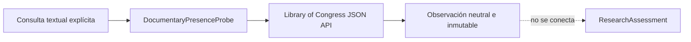

# Library of Congress Documentary Presence Experiment

## Estado

Experimento técnico neutral. **No es una ResearchCapability**, no produce
`EvidenceRecord`, no usa `ResearchCategory.COMPETITION` y no puede satisfacer
ni cerrar un `ResearchNeed`.

## Qué mide

Obtiene una fotografía de los registros de la colección pública `books` que la
[API JSON oficial de Library of Congress](https://www.loc.gov/apis/json-and-yaml/)
devuelve para una consulta textual explícita. Es una señal de
`documentary_presence`: presencia documental observable en esa fuente y en ese
momento.

Puede servir en el futuro como contexto educativo o documental. No mide oferta
comercial. La documentación oficial también aclara que la API JSON/YAML no
incluye el catálogo bibliotecario completo.

## Qué no significa

- no identifica productos, categorías, marcas, listings o vendedores;
- no mide competencia, saturación, ventas, precios, disponibilidad o cuota;
- no representa Amazon, eBay ni otro marketplace;
- no representa US ni otra región comercial;
- no recomienda comprar, vender, invertir o probar una oportunidad.

## Arquitectura deliberadamente aislada



El probe expone `observe(query)` y un resultado propio con estados
`success`, `partial`, `no_data` y `failure`. Deliberadamente no expone
`capability_id`, `supported_categories`, `can_handle()` ni `execute()`.

## Trabajo técnico conservado

- cliente HTTPS con allowlist de `www.loc.gov`;
- ruta `/books/` y parámetros exactos;
- redirects, puertos y credenciales embebidas rechazados;
- timeout, límite de 1 MB y `application/json` obligatorio;
- parser conservador y fixtures sintéticos;
- hash SHA-256 semántico independiente del timestamp;
- observaciones históricas independientes;
- separación estricta de `partial`, `no_data` y `failure`;
- sin HTML, cookies, secretos, payload completo ni PII privada.

La consulta conserva `region = None`, `marketplace_id = None` y `currency =
None`. Los identificadores oficiales HTTP contenidos en la respuesta se
canonicalizan a HTTPS, pero toda adquisición de red exige HTTPS.

## Freshness

Cada observación es una fotografía recuperada en un momento concreto. Una
fotografía antigua puede perder relevancia actual sin perder su valor histórico.
El experimento no sobrescribe observaciones anteriores.

## Fuente y límites

La API es pública y no requiere clave, pero aplica rate limiting y puede
responder HTTP 429. V1 realiza una sola página de hasta diez registros.

- [Solicitudes](https://www.loc.gov/apis/json-and-yaml/requests/)
- [Parámetros](https://www.loc.gov/apis/json-and-yaml/requests/parameters/)
- [Límites](https://www.loc.gov/apis/json-and-yaml/working-within-limits/)

## Pruebas y smoke

Las pruebas deterministas no utilizan Internet. El smoke manual separado hace
una única consulta pequeña:

```bash
python3 -m tests.smoke_library_of_congress_documentary_presence
```

No se deben reutilizar sus valores vivos como expectativas permanentes.
